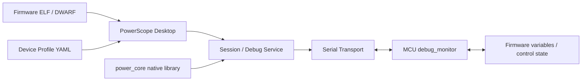

# PowerScope

**面向光伏微逆变器、储能 PCS 与 MCU 固件联调的桌面调试、变量观测与波形分析工具。**

PowerScope 希望解决功率电子固件开发中一个很实际的问题：工程师往往需要同时使用串口助手、变量监视工具、ELF 符号查询、波形记录脚本和临时调参界面。PowerScope 将这些能力放在一个可配置的桌面应用中，并通过轻量级 MCU 调试桩与目标固件建立应用层调试通道。

> PowerScope 不是 J-Link / SWD / JTAG 调试器的替代品。它更适合设备运行状态下的串口遥测、变量读写、实时波形、参数调试与工程联调。

当前项目处于持续开发阶段，仓库包含通用框架以及部分真实工程适配。接口和目录在 `1.0` 之前仍可能调整。

## 功能概览

- **串口连接与数据监视**：基于 `pyserial` + Qt 线程的串口收发，可用于高波特率连续数据流。
- **ELF / DWARF 变量解析**：读取固件 `.elf` 的符号表与 DWARF 信息，解析全局变量、结构体成员、地址和类型。
- **变量监视与实时波形**：将 profile 变量或 ELF 符号加入采样列表，进行实时绘图、录波和 CSV 导出。
- **设备 Profile**：使用 YAML 描述连接参数、变量映射、仪表盘和控制项；仓库已包含微逆、储能和 NS800RT 联调示例。
- **MCU Debug Stub**：提供平台无关的 `debug_monitor.c/.h`，支持内存读取、受控写入、批量采样、流式上传、设备信息与复位等调试命令。
- **Native C Core**：`power_core` 提供 CRC16、环形缓冲区、Modbus RTU 与 PowerScope 调试协议的 C 实现，由 Python 通过 `ctypes` 调用。
- **功率控制调试辅助**：包含 PID/PI 离线仿真、参数分析及调参视图。
- **实验性 AI 辅助**：代码中提供 DeepSeek、OpenAI、Claude、Ollama 等模型接入以及无 API Key 时的本地/规则降级路径。
- **工程适配示例**：当前主界面还包含 MSG 命令、功率仪表盘和串口升级等实际项目联调能力。

## 架构



PC 端负责 UI、ELF 解析、会话管理与数据展示；MCU 端只需要集成一个较小的调试桩，并提供串口发送、时间戳和复位等硬件抽象接口。

## 环境要求

- Python **3.10+**
- Windows 为当前主要开发环境
- 一个可用的 C 编译器，用于从源码构建 `power_core`
  - Windows：TCC / MinGW GCC 等
  - Linux：GCC / Clang 等

仓库当前**不提交预编译的 EXE、DLL 或 SO 文件**。Native core 需要在本地从 `power_core/src` 构建。

## 安装

### 1. 获取源码

```bash
git clone https://github.com/Wanchenrui/PowerScope.git
cd PowerScope
```

### 2. 创建 Python 环境

Windows PowerShell：

```powershell
python -m venv .venv
.\.venv\Scripts\Activate.ps1
python -m pip install --upgrade pip
pip install -r requirements.txt
```

Linux / macOS shell：

```bash
python3 -m venv .venv
source .venv/bin/activate
python -m pip install --upgrade pip
pip install -r requirements.txt
```

### 3. 构建 Native Core

Windows + TCC：

```powershell
tcc -shared -o power_core.dll -Ipower_core/include power_core/src/*.c
```

Linux + GCC：

```bash
gcc -shared -fPIC -O2 -Ipower_core/include power_core/src/*.c -o libpower_core.so
```

生成的 native library 放在仓库根目录即可被 `power_scope/core/cffi_loader.py` 自动找到。

### 4. 启动 PowerScope

```bash
python app.py
```

也可以直接启动 Python 包入口：

```bash
python -m power_scope.main
```

如需显式加载某个设备 Profile：

```bash
python app.py power_scope/profiles/microinverter.yaml
```

## 快速开始

1. 按上面的步骤安装 Python 依赖并构建 `power_core`。
2. 运行 `python app.py`。
3. 在 PowerScope 中选择串口并连接目标设备。
4. 加载目标固件编译生成的 `.elf` 文件。
5. 在变量视图中搜索全局变量或结构体成员，并加入实时采样。
6. 在波形视图中观察数据、录制波形或导出 CSV。

如果只是开发 PC 端逻辑，仓库也提供 `MockTransport`，用于在没有真实串口设备时构建测试和模拟流程。

## MCU 接入

MCU 侧代码位于：

```text
mcu_debug_stub/
├── debug_monitor.c
├── debug_monitor.h
└── port/
    └── stm32_hal_port.c
```

`debug_monitor` 本身不依赖特定 MCU SDK。移植到新的 MCU 工程时，核心工作只有下面几步。

### 1. 加入调试桩源码

将以下文件加入 MCU 工程：

```text
mcu_debug_stub/debug_monitor.c
mcu_debug_stub/debug_monitor.h
```

### 2. 实现 3 个硬件抽象接口

```c
void dbg_uart_send(const uint8_t* data, uint16_t len);
uint32_t dbg_get_timestamp_us(void);
void dbg_system_reset(void);
```

它们分别负责：

- 通过调试 UART 发送数据；
- 返回单调递增的微秒级时间戳；
- 执行系统复位。

仓库中的 `mcu_debug_stub/port/stm32_hal_port.c` 给出了 STM32 HAL 的完整接入示例。

### 3. 接入 UART RX 与周期 Tick

初始化时调用：

```c
debug_monitor_init();
```

UART 每收到一个字节时送入协议解析器：

```c
debug_monitor_feed_byte(rx_byte);
```

在 SysTick 或硬件定时器中周期调用：

```c
debug_monitor_on_tick();
```

Tick 周期应能够覆盖你希望实现的采样周期；高频采样场景建议使用独立硬件定时器，并确保调试任务优先级低于 PWM、ADC 和保护中断。

### 4. 配置可访问内存区域

调试桩带有地址访问保护。移植到不同 MCU 时，应根据实际 SRAM / RAM 地址范围配置白名单，不要直接开放整个地址空间。

如需增加区域，可使用：

```c
debug_monitor_add_region(start_address, end_address, permission);
```

其中写权限应只开放给明确允许在线修改的 RAM 区域。Flash、外设寄存器、保护状态和关键控制变量不应默认开放写权限。

### 5. 编译固件并加载 ELF

建议保留符号表，并在可行时保留 DWARF 调试信息。PowerScope 会使用 `.elf` 中的变量地址和类型信息建立 PC 端变量视图。

典型联调链路为：

```text
PowerScope
    │
    │  UART / USB-UART
    ▼
MCU debug_monitor
    │
    ├── read / write memory
    ├── sample list
    ├── stream data
    └── device info / reset
```

当前调试协议以 `0xA5 0x5A` 为帧头，并使用 CRC16-Modbus 进行完整性校验。

## Device Profile

PowerScope 使用 YAML Profile 描述不同设备，而不是把所有变量和控制逻辑硬编码进 UI。

仓库当前提供：

```text
power_scope/profiles/
├── microinverter.yaml
├── ess_storage.yaml
└── ns800rt_smoke.yaml
```

Profile 可用于定义：

- 串口与连接参数；
- ELF 文件路径；
- 变量名称与 ELF symbol 映射；
- 单位、比例、显示精度和刷新周期；
- 仪表盘组件；
- 控制按钮及参数范围。

如果你要接入新的 MCU 或新的功率产品，优先新增 Profile；只有协议、传输或交互模式发生变化时，才需要修改 Python 核心代码。

## 核心目录

```text
PowerScope/
├── app.py                    # 根目录启动入口
├── power_scope/              # Python 桌面应用
│   ├── config/               # YAML Device Profile
│   ├── core/                 # 协议、服务、安全护栏、仿真等
│   ├── debug/                # ELF / DWARF 解析
│   ├── llm/                  # AI / 本地调参辅助
│   ├── profiles/             # 设备配置示例
│   ├── session/              # 会话控制
│   ├── transport/            # Serial / Mock Transport
│   └── ui/                   # PySide6 UI
├── power_core/               # Native C core 源码
├── mcu_debug_stub/           # MCU 端调试桩与移植示例
├── tests/                    # Python 测试
├── requirements.txt          # Python 依赖
└── LICENSE                   # MIT License
```

## 测试

完成 Python 依赖安装并构建 native core 后：

```bash
python -m pytest tests -q
```

C core 的测试源码位于 `power_core/tests/`，MCU debug stub 的测试源码位于 `mcu_debug_stub/tests/`。

## 安全说明

PowerScope 支持目标变量写入、控制命令、复位和固件联调功能。连接真实功率设备时：

- 不要在未经确认的情况下开放任意内存写权限；
- 功率级带电测试前，应先验证保护链路和参数范围；
- 在线参数修改应保留限幅、二次确认和可回退机制；
- 调试通信中断优先级应低于 PWM / ADC / 硬件保护链路。

本项目是开发与调试工具，不替代产品自身的功能安全设计。

## License

PowerScope is licensed under the [MIT License](LICENSE).

欢迎通过 Issue / Pull Request 提交问题、移植适配和改进建议。
