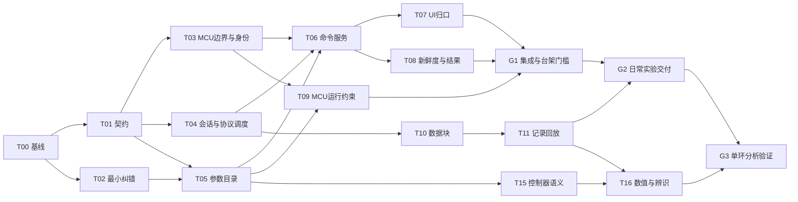

# PowerScope AI 团队分工与开发步骤

版本：2026-09-06｜团队：AI subagent，每个上下文上限 256k｜目标硬件：纳芯微 NS800RT5039

架构依据：[《PowerScope 架构优化与宏观规划》](D:/GitHub/PowerScope/docs/planning/PowerScope_架构优化与宏观规划_2026-09-06.md)。本文件可作为后续协调 agent 的派工依据；所有“新增文件、目标接口、拟新增测试”均为待开发项，不代表仓库已经实现。

## 1. 执行目标与不可跳过的事实

首个完整交付是：**对当前 NS5039 微逆，身份核验后可靠观测，在已确认停机状态完成允许参数的写入和回读，保存可追溯实验并离线回放。** 储能先做独立观测适配，取得实际设备资料后才扩展控制。

派工时固定以下基线，并在每个新任务开始时重新检查是否变化：

| 名称 | 工作区与初始提交 |
|---|---|
| PC | `D:\GitHub\PowerScope`，`e2ce8ab8b8fb5ecd9eba3973b015ca6c5864b70d` |
| FW | `D:\GitHub\newns800RT50xx`，`3469da8eaeb2b5657381df49817e350f35964c15` |
| ELF | [已有构建物](D:/GitHub/newns800RT50xx/Debug/C01_2in1_20260821_ongridStable.elf)，SHA-256 `80b8ba7c699df7316c1e5d084bd37112e36c589bd9c7d90cd94fea47c0d9f9ec` |

已验证事实：14 个选定测试文件共 178 项通过；配置负量程往返、NaN/未知变量放行、录制未提交关闭、uint64 精度、陈旧监测提交、MSG 迟到 ACK 等缺口已离线复现。现存 ELF 的 28 个配置变量有 1 个解析失败；18 个调参字段仅 8 个在固件参数写白名单内，部分允许写的 PI 在当前电流环中没有被调用。详细证据见架构文件第 2、4、5 节。

没有完成的工作：完整 GUI/测试套件、native C 构建、目标固件重建、串口联调、升级试验及带电台架验证。不能把这些项目从待办中删去，也不能根据 Mock 结果替代完成。

## 2. 团队组织：角色池，不是同时启动七个 agent

建议每批 **1 个协调 agent + 最多 3 个执行/审查 agent**。角色按阶段轮换；独立审查也占一个槽位。256k 是上下文容量，不意味着七个角色必须同时存在，更不意味着可以并行修改同一个文件。

| 角色 | 核心职责 | 默认可修改范围 | 不能自行决定的事项 |
|---|---|---|---|
| O：协调与契约 | 任务依赖、接口冻结、文件锁、双仓库集成、验收汇总 | 任务清单、契约/ADR、集成记录；必要时处理已审查冲突 | 不凭实现者口述宣布台架通过；不自动扩大范围 |
| C：PC 会话与命令 | 连接、能力、请求匹配、命令服务、写入策略、安全监督 | PC session / transport / Debug / MSG / Guardrails / SafetyController，按具体任务授权 | 不修改功率控制算法，不扩大 FW 白名单 |
| F：固件与协议 | 实际 5039 的边界、能力、身份、运行约束、升级完整性 | FW 调试模块、串口适配、相关头文件及测试接缝 | 不顺带改 PWM/保护阈值，不取消 PI 注释，不替换预编译控制库 |
| D：数据与实验 | 类型块、队列、记录、回放、质量和时间语义 | PC 数据通道、记录器、实验服务及对应测试 | 不为了显示流畅丢弃原始实验数据而不记录缺口 |
| U：界面与使用流程 | 将所有入口接服务、设备页面隔离、绘图、错误提示 | PC UI、设备视图与对应 UI 集成测试 | 不持有直接设备写函数，不在 UI 再实现一份校验器 |
| A：控制分析与 AI 提案 | 控制器语义、数值基准、分析适用性、结构化建议 | PC simulator / tuning / bode / step / llm，FW 控制代码只读 | 不把仿真结果当台架结论，不自动执行模型建议 |
| Q/E：独立验证与工程环境 | 独立反例、协议向量、回归、构建/打包、性能记录 | 专属测试/夹具、CI、构建脚本；审查时原则上不改被审实现 | 不复制实现逻辑产生期望值，不以测试总数代替关键门槛 |

同一个逻辑角色可由不同 agent 接续，但一个任务的最终审查者必须与实现者分开。审查发现问题后由实现者修复；审查者需要改测试时先取得该测试文件的归属，避免双方同时修改。

**真实台架不是另一个虚构的“人类研发岗位”。** AI 团队负责准备步骤、自动化、日志解析和判据；涉及接线、供电、负载和保护确认的实际执行，需要具备对应设备与权限的操作者或受控台架工具。缺少这些条件时状态为 `BENCH_PENDING`，其他离线任务继续推进。

## 3. 上下文、工作区与交接规则

### 3.1 每个任务只装入需要的上下文

任务包包括目标、基线、已冻结接口、相关源码/测试、当前反例和明确输出；不要将两份长报告、全部 SDK、所有 UI 和所有历史日志重复塞进每个 agent。

建议初始任务包控制在约 10k–40k tokens；复杂跨端任务可增加，但启动上下文尽量不超过 80k。工作中在总上下文约 160k–180k 时做检查点，为工具结果、审查和交接留余量。这是组织建议，不是对模型表现的保证，也不是要求用满预算。

| 任务类别 | 应读材料 | 默认不装入 |
|---|---|---|
| C/F 协议任务 | 真实 UART/Debug 源码、PC 对应 codec、冻结线格式、边界夹具 | 完整 GUI、LLM 历史、芯片外设 SDK 全文 |
| D/U 数据任务 | SampleBlock、现有 WaveCodec/绘图/导出、典型录波和质量规则 | 功率算法库、所有 MCU 初始化代码 |
| A 分析任务 | 控制周期与参数定义、有效调用链、固定实验数据、独立数值基准 | 原始串口写权限、云凭据、无关产品报告 |
| Q 审查任务 | 任务契约、变更 diff、独立输入/期望和实际命令日志 | 实现者长篇推理记录；只读简洁设计理由即可 |

检查点交接控制在 2k–4k tokens 左右，包含最新提交、未提交改动、已通过命令及时间、未解决反例、下一个动作和文件归属。新 agent 先读实际 diff 与工作区状态，不能只相信交接摘要。长日志保存为文件，摘要保留退出码和必要片段。

### 3.2 文件与分支隔离

优先为每个实现任务使用独立 worktree；PC 与 FW 分属不同仓库，跨端任务记录两个 worktree 和两个提交。若工具只能共享当前目录，O 必须用文件锁表串行安排有重叠文件的任务。

建议分支名称格式为 `plan/<task-id>-<short-name>`，以任务开始时的集成提交为基点；这是后续建议命名，不要求此次创建。不要把本报告中的初始提交永远当成新任务起点，否则已合并修复会被遗漏。

高冲突文件只允许一个写入者：

| 文件/契约 | 归属与顺序 |
|---|---|
| [main_window.py](D:/GitHub/PowerScope/power_scope/ui/main_window.py)、[power_main_window.py](D:/GitHub/PowerScope/power_scope/ui/power_main_window.py) | T02 的最小修复完成后交给 U；T07/T12/T13 依次预约涉及的集成点，C 不同时改 UI |
| [debug_service.py](D:/GitHub/PowerScope/power_scope/core/debug_service.py)、[msg_service.py](D:/GitHub/PowerScope/power_scope/core/msg_service.py) | C；T04 的能力/请求接口冻结后，后续任务通过公开接口调用 |
| [event_bus.py](D:/GitHub/PowerScope/power_scope/core/event_bus.py) | T01 冻结事件语义；T04 如需接入先预约，T10 由 D 接管高频拆分 |
| [device_profile.py](D:/GitHub/PowerScope/power_scope/config/device_profile.py) 与 NS/ESS 配置 | T02 → T05 → T17，顺序交接；其他 agent 提交 schema 变更请求 |
| [debug_monitor_core.c](D:/GitHub/newns800RT50xx/user/source/debug_monitor_core.c)、[uart_msg_port.c](D:/GitHub/newns800RT50xx/user/source/uart_msg_port.c) | F；T03 → T09；T14 如需同文件须等待释放 |
| 拟新增共享 contracts、协议规范、golden 向量 | O 指定唯一维护者；接口变更必须通知消费方，不能各写同名结构 |
| [conftest.py](D:/GitHub/PowerScope/tests/conftest.py)、构建和 CI 配置 | E；其他任务尽量使用专属夹具，公共修改经 O 排队 |

合并顺序由依赖决定。每个集成点记录 `(PC commit, FW commit, DevicePack version, ELF/bin hash)`，不把两个仓库当成可自动原子提交的一件事。保留用户已有改动，不为解决冲突 reset、清空或覆盖工作区；未跟踪的规划文档也需要保留。

## 4. 总体依赖与批次

### 4.1 主链



图省略旁支，批次安排如下，精确依赖以各任务卡为准。T19 是按阶段重复使用的验收包，不是等全部开发完成才首次测试。

| 批次 | 可并行执行的示例 | 集成/退出条件 |
|---|---|---|
| B0 | E 做 T00；C 做 T02 的已有反例分析；O 整理 T01 输入 | T00 完成后执行 T02 修复，冻结 T01 第一版。报告阅读不算代码交付 |
| B1 | F：T03；C：T04；Q/设备目录实现者：T05 | 各自专属测试，协议契约一致；Q 在实现完成后换独立 agent 审查 |
| B2 | C：T06；F：T09；D：T10 | 新命令服务、FW 约束、数据字段分别审查；共享文件按预约顺序提交 |
| B3 | U：T07；C：T08；D：T11 | T19-G1 离线集成，具备条件后进行 G1 台架；未通过时写入能力保持受限 |
| B4 | U：T12；C：T13；E：T18 的发布准备 | T13 的 UI 改动在 T12 释放相应文件后合并；完成 T19-G2 |
| B5 | A：T15 后做 T16；适配 agent：T17；Q：数据/算法独立反例 | 数值实现与实际控制语义均通过；ESS 只读范围明确 |
| B6 | A：T22；Q：T19-G3；O：发布与需求复盘 | 只开放通过验证的一个环，其他环继续标记能力状态 |
| 条件批次 | T14 升级完整性；T20 开源存储对照；T21 通用桩同步 | 由真实功能需求触发，不能为了“任务全绿”挤掉主链 |

T10/T15 等离线工作可以提前，但不会提前获得对应的设备执行权限。T18 在基线环境建立后持续补充，最终发布检查等待实际合入版本。T14 若未完成，应限制相应升级能力；不能以它属于条件批次为由忽略已知完整性缺口。

### 4.2 状态与排期口径

任务状态使用 `PLANNED → IMPLEMENTING → CODE_REVIEW → CODE_VERIFIED`；需要硬件时继续 `BENCH_PENDING → BENCH_VERIFIED`；满足所在阶段全部条件后才是 `RELEASED`。失败可以回到实现状态，阻塞记录具体缺失输入和可继续的工作。

不用人工“几人几周”估算 AI 工作量。先完成 T00/T02/T03，记录实际 agent 周转、审查轮数和集成耗时，再估算后续批次区间；硬件档期另列。并行收益受接口和文件重叠限制，不能用“任务总数 ÷ agent 数量”承诺交期。

## 5. 详细任务卡：基线、契约与命令链

每张卡的测试都需要真实失败/成功证据。建议新测试文件名称用于表达意图，若仓库已有对应测试应优先扩展，避免重复建设。

### T00 — 固定基线并打通可复现环境

**负责人：E；审查：Q；依赖：无；关联：F14。**

输入为双仓库提交、现存 ELF、[依赖文件](D:/GitHub/PowerScope/requirements.txt)、[native 加载器](D:/GitHub/PowerScope/power_scope/core/cffi_loader.py)、PC/FW 构建说明和当前测试日志。可改构建/依赖/测试环境文件；业务逻辑不在此任务中改。

1. 记录 git 状态、Python/Qt/NumPy 版本、C 编译器、ARM 工具链、ABI、库路径及构建物哈希，区分 PATH 缺失与机器未安装。
2. 建立隔离环境，补齐明确的运行依赖；分开 runtime/dev 依赖并锁定经过验证的组合，不能把全局 Python 3.14.4 当成必须支持的发布版本。
3. 在隔离目录构建 native C，验证导出符号、参数宽度和 ctypes 结构；修正导出宏/构建入口时保持行为和 ABI 可测。离线工具不应因不相关 native 模块缺失直接崩溃，延迟加载和诊断应有明确策略。
4. 找到真实 ARM 工具链与生成构建方式，先在隔离工作树重建现有 FW；记录预编译 `libcbb` 等库哈希、链接 map 与内存占用。没有可用工具链时输出缺口，不能拿现存 ELF 宣称重建成功。
5. 先运行本文第 9 节基线，再运行与环境相关的更广测试；保存退出码、失败类别、GUI/设备测试跳过原因。

**验收：** 新环境可重复得到同一类构建和测试结果；缺依赖有清晰诊断；没有隐式依赖个人绝对路径。输出环境锁定、构建说明、基线结果和工具链缺口。暂不承诺 Linux/macOS。

### T01 — 冻结最小跨端契约与 build ID 方案

**负责人：O 指定的契约 agent；审查：C/F；依赖：T00 的清点；关联：F02/F03/F06。**

只改拟新增契约、协议规范、schema 和契约测试。实际业务改动交给消费任务。

1. 写出 DeviceIdentity/Capabilities、Variable/ParameterDescriptor、Observation/SampleBlock、CommandIntent/Receipt 第一版字段、单位、枚举和缺失值行为。
2. 根据实际 C 源码固定字节序、字段偏移、请求/响应开销、错误码、16 项/64 字节限制；列出已有 GetInfo 稳定前缀和可选扩展策略。
3. 定义 build ID 的生成、链接保留及 manifest 绑定；明确 ELF/bin/静态库哈希与 build ID 各自作用，解决 dirty build 和复现构建的记录方式。
4. 定义 epoch 失效条件、Unknown 的恢复途径、实际状态确认依据；明确旧 MSG ACK 不能靠 host epoch 完成无歧义配对。
5. 提交旧 PC/新 FW、新 PC/旧 FW 的兼容矩阵，冻结消费接口；不为尚无需求的云、多设备同步、任意插件设计字段。

**验收：** C/F 可分别依据规范构造同一帧，错误情况也有唯一解释；接口缺失时明确降级。借鉴 [Scrutiny 固件描述](https://github.com/scrutinydebugger/scrutiny-main/blob/07c581a0b154c521cf92781957125ff4367dbc71/scrutiny/core/firmware_description.py) 和 [连接状态](https://github.com/scrutinydebugger/scrutiny-main/blob/07c581a0b154c521cf92781957125ff4367dbc71/scrutiny/server/device/device_handler.py)，不移植整套协议。

### T02 — 先修已有错误，避免等待大重构

**负责人：C；审查：Q；依赖：T00 可运行相关测试；关联：F01/F04。**

可改 [device_profile.py](D:/GitHub/PowerScope/power_scope/config/device_profile.py)、[guardrails.py](D:/GitHub/PowerScope/power_scope/core/guardrails.py)、[ai_tool_context.py](D:/GitHub/PowerScope/power_scope/ui/ai_tool_context.py)，以及预约后的 [power_main_window.py](D:/GitHub/PowerScope/power_scope/ui/power_main_window.py) 最小设备隔离部分。

1. 用已有复现建立失败回归：负范围往返、历史键、未知变量、NaN/Inf、校验器缺失/异常。
2. 修正 YAML 写出键与兼容读取，保留原值语义；命令值不再复用显示量程进行静默限幅。
3. 未知权限和校验异常返回拒绝；UI 显示具体原因，不能伪装为写入成功。
4. 按设备类型限制 C01 专用准备/页面，移除会静默覆盖用户 ELF 的固定路径行为；ESS 和通用 profile 不新增微逆变量或启动 MSG 轮询。
5. 暂时禁用缺少身份、类型或权限证据的控制入口；后续由 T06/T07 的统一能力状态接管，避免多处永久 feature flag。

**验收：** `inv_curr_freq_kp` 的 `[-10000,0]` 往返不变，`run_state=255` 不能被悄悄改成 100 后发送；ESS 不再增加 23 个 C01 变量。保存旧配置可读性，此任务不引入完整 schema v2。

### T03 — 实际 MCU 协议边界、能力与身份

**负责人：F；审查：Q/C；依赖：T01；关联：F02/F03。**

可改 [debug_monitor_core.c](D:/GitHub/newns800RT50xx/user/source/debug_monitor_core.c)、[头文件](D:/GitHub/newns800RT50xx/user/include/debug_monitor_core.h)、必要的构建标识段及协议测试接缝。`uart_msg_port.c` 只有接口需要时预约修改。

1. 将 ReadMemory 请求上限与响应有效载荷容量统一：当前 `192 - 11 = 181`，超限明确 NACK，PC 后续分段。用常量推导并加静态断言，避免再埋两份数字。
2. 导出真实读批次数、采样行宽、最小/有效周期、波形能力和构建身份；处理旧 GetInfo 前缀兼容。
3. 验证配置采用临时对象校验后提交、采样布局 ACK 返回有效周期等现有行为；不要重写已经正确的 DMA 整帧队列。
4. 对队列满、响应暂存槽占用、CRC 错误和超时增加可观测结果或计数，明确哪些请求可重试。
5. 让测试执行实际 `debug_monitor_core.c` 的解析/处理路径，HAL、UART 和地址访问可用窄测试接缝替代。64 位主机不能直接把 MCU 32 位地址当主机指针；无法安全映射时改用目标测试环境，不以通用桩冒充实际实现。

**验收：** 181 字节有效响应可产生，182/192 超限明确失败，193 及截断载荷被拒绝；16/17 项边界、跨区间读、长度溢出、坏 CRC、未知命令均覆盖。输出 PC 可用 golden 帧、目标构建/map 及台架待验项，保持现有内存 ACL 不放宽。

### T04 — Session、能力协商与请求生命周期

**负责人：C；审查：Q；依赖：T01；真实端集成依赖 T03；关联：F03/F07。**

可改 [SessionController](D:/GitHub/PowerScope/power_scope/session/session_controller.py)、[SerialTransport](D:/GitHub/PowerScope/power_scope/transport/serial_transport.py)、[DebugService](D:/GitHub/PowerScope/power_scope/core/debug_service.py)、[MsgService](D:/GitHub/PowerScope/power_scope/core/msg_service.py) 和协议入口适配。不得同时修改 UI 集成点。

1. 建立打开端口、握手、受限观测、准备完成、故障/断开的状态及 epoch；串口错误同步改变状态，清理挂起请求、旧解析缓冲与订阅。
2. 自动读取身份/能力，将请求切块、采样通道和周期受协商上限约束；缺能力采用已知兼容配置或受限模式，不默认最大能力。
3. 只有 Session 持有最终 Transport 写入口；Debug/MSG 正常调度，升级和 RAW 使用独占令牌；读监视作为数据副本。
4. Debug 挂起请求匹配 epoch、序号、预期命令和长度，正确处理拒绝、超时、乱序和序号回绕。
5. MSG 单在途及超时不确定状态：重现 A 超时/B 同命令/迟到 ACK；能回读的先对状态，不能消歧的禁止当作新请求成功，等待会话恢复或升级协议。
6. 给串口写和退出有界等待，短写/异常可见；连接按钮只表达会话状态，不让 UI 独立猜测连接成功。

**验收：** 拔线、重连、换 profile、设备重启、旧响应、部分写出均有测试；旧 ACK 不会把新命令标 Verified。这里处理协议职责重叠，不以“多个解析器必然竞争消费”作为设计前提。

### T05 — 真实参数目录与设备配置迁移

**负责人：设备目录 agent（C）；FW 只读协作：F；独立审查：Q；依赖：T01/T02；关联：F02/F10。**

可改 PC 设备配置、参数描述/manifest 生成器和 ELF 描述适配；不改 FW 白名单和控制算法。

1. 从实际源码、ELF 和白名单生成可复核清单：别名、符号、类型来源、字节宽度、读写权、工程单位、显示范围/写范围、当前生效条件。
2. 处理 `pllPhase` 未解析，输出诊断并禁用其订阅；找替代符号必须有含义证据，不按相似名字自动替换。
3. 为 18 个调参字段输出五个独立状态：可解析、可读、允许写、当前生效、可用于整定。8 项写白名单与 10 项只读状态必须吻合现有 FW；电流 PI 注释状态单独标记。
4. 引入最小 DevicePack 注册；身份、类型猜测、固件库版本不确定时禁止地址型写入。单位和缩放必须有来源，不能把 UI 小数位当标定证据。
5. 迁移 NS 配置并保留旧 YAML 读取；ESS 模板只保留自己的字段和描述，不冒充真实储能产品。

**验收：** 有机器可检查的权限差异报告；白名单允许但未参与控制的字段不会被列为“可自动整定”；换 ELF 使旧解析/权限缓存失效。可借鉴 [foxBMS 类型化数据块](https://github.com/foxBMS/foxbms-2/blob/308028fb13d046ba29b98886895c2e17937b1437/src/app/engine/database/database.c)，不引入其完整固件数据库架构。

### T06 — 唯一 CommandService 与写入结果

**负责人：C；审查：Q/F；依赖：T03/T04/T05；关联：F04/F05/F06。**

可新增 PC 命令服务、参数编码器、结果对象，修改 Guardrails 与服务接口。UI 迁移属于 T07；此任务不直接编辑大主窗口。

1. 实现受控意图：参数写、设备启动/停止、运行模式、清故障、升级请求及维护模式申请；查询另走只读接口。
2. 在一个入口校验会话、身份、类型、有限值、写范围、权限、运行状态、新鲜度、截止时间和模式独占；失败默认拒绝且记录原因。
3. 新鲜回读锚点，编码检查符号/缩放/宽度，执行 ACK 与回读。保留请求值、实际编码值和设备回读值；参数型与状态型确认判据分开。
4. 状态推进严格区分 Sent/Acked/Verified/Rejected/Unknown；异常和短写不能伪装成功。多参数只记录逐项结果，不声称设备原子提交。
5. 限制重试：读取可按规则重试，启动/清故障/升级等副作用命令不能在响应不明时盲目重发；恢复动作按设备语义执行。

**验收：** 无权限、错误模式、NaN/Inf、uint 溢出、非对齐宽度、过期锚点、ACK 后回读不一致、写入中断、部分完成均有反例。日志仅在相应阶段成立时推进。拟新增测试可命名 `test_command_service.py`，实现者不得用同一个编码函数同时生成期望值和实际值。

### T07 — 所有 UI/AI 写入入口归口

**负责人：U；审查：Q/C；依赖：T06；关联：F01/F05/F06。**

可改 [主窗口](D:/GitHub/PowerScope/power_scope/ui/main_window.py)、[功率扩展窗口](D:/GitHub/PowerScope/power_scope/ui/power_main_window.py)、[变量检查器](D:/GitHub/PowerScope/power_scope/ui/variable_inspector_view.py)、[调参页](D:/GitHub/PowerScope/power_scope/ui/tuning_view.py)、[AI 上下文](D:/GitHub/PowerScope/power_scope/ui/ai_tool_context.py) 和控制控件。T13 涉及升级集成点，后续预约。

1. 按第 8 节入口矩阵逐项把写调用替换为 CommandService 意图；删除由 UI 自己判定成功的重复逻辑。
2. 只根据服务能力和 Receipt 更新按钮、状态和日志；显示禁用原因、等待确认、未知结果及恢复路径。
3. 保留只读串口监视；正常模式原始发送不可绕过受控入口，AI 没有 RAW 能力。
4. 用设备包选择页面与命令，不在切换 ESS 后继续微逆 MSG/变量订阅；切换源和 profile 清理旧信号、布局及缓存。
5. 在真实 QWidget 调用路径上做最小集成测试：模拟点击→实际服务→替身传输，覆盖允许/拒绝/超时。源代码搜索只用来辅助确认无遗留旁路。

**验收：** 每个副作用入口均能被统一策略拒绝；不存在 `apply_pending` 先报成功再忽略发送结果；参数检查器的普通写与写后验证不形成两个权限体系。

### T08 — 安全观察、新鲜度与不确定状态恢复

**负责人：C；审查：Q；依赖：T06，使用 T01/T04 的 Observation；关联：F08。**

可改 [SafetyController](D:/GitHub/PowerScope/power_scope/core/safety_controller.py) 及其服务级测试；不修改保护阈值或固件闭环。

1. 先建立当前反例：窗口 5 秒、关键量最后更新为 0、当前 6 秒时不能提交；删除接受错误提交行为的旧预期，并说明依据。
2. 为每个关键变量维护 epoch、最后有效观测、质量和时间；任意一个过期、无效、缺失即不满足观察条件，不能靠另一个不断更新的量掩盖。
3. 准备/写入/观察阶段均设截止时间；提交前先验证新鲜度和故障，再判断窗口；人工确认也经过相同条件。
4. 停机请求、状态确认、参数恢复分别记录。停机发送失败/状态未知时不能出现“设备已停机”；恢复失败保留逐项未知结果。
5. 把停止与参数恢复的顺序做成设备策略，第一版采用受限的停机单参数流程；在线事务保持关闭。

**验收：** 关键量部分失联、NaN、旧 epoch、准备超时、停止失败、恢复部分失败和用户提前确认均不能错误提交。测试用注入单调时钟推进，不用真实 sleep 凑窗口。

### T09 — 固件侧参数运行约束

**负责人：F；审查：Q/C；依赖：T03/T05；关联：F06/F10。**

可改调试写入校验及与现有 FSM 的窄接口。功率算法、保护设定和白名单扩大不在范围内。

1. 对当前允许参数明确停机/维护状态要求；scratch 可保留不影响控制的独立规则，不与真实系数混为一类。
2. 使用现有 FSM/运行标志定义设备端拒绝条件；读权限保留，越权写、类型和有限值校验不放宽。
3. 把“命令受理”与“实际状态”字段分开，提供 PC 可核验的状态/错误信息；不让 debug watchdog 的停流行为冒充停机。
4. 核查主循环写参数与 ISR 读参数的时序；第一版不新增在线多参数提交，若只能停机后保证一致性就明确限制。
5. 新旧 PC 的合法停机读写仍可用，运行中写被明确拒绝并说明这是新增策略约束。

**验收：** scratch 正向、白名单参数停机写、运行中拒绝、非白名单拒绝、NaN/Inf 拒绝都有实际 C 路径测试。FSM/PWM 最终状态仍需 T19 台架验证。

## 6. 详细任务卡：数据、界面与升级

### T10 — 有界数据块和统一时间/质量

**负责人：D；审查：Q/C；依赖：T01/T04；关联：F15。**

可改 [EventBus](D:/GitHub/PowerScope/power_scope/core/event_bus.py)、[StreamingManager](D:/GitHub/PowerScope/power_scope/core/streaming_manager.py)、WaveCodec 的数据适配及拟新增块队列；不重新设计 MCU Wave v2 线格式。

1. 从现有慢变量、Live、Recorder 解码结果形成 SampleBlock，保留原始 dtype、序号、列表/capture ID、实际周期、设备 tick 单位和 host monotonic 时间。
2. 区分慢事件与高频块，定义队列容量、内存预算、消费者速度不足时的行为和可观察计数。
3. 处理回绕、重启、缺包、重复块、错序和部分捕获；质量缺口不能被插值后当作原始数据。
4. 图形和记录器独立消费；停止/重新配置采样时旧块不进入新布局，继续保留现有 ACK 后提交布局的机制。
5. 用固定长度录波/合成数据做批量压测，记录 CPU、RSS、队列峰值与数据缺口，给 T12/T18 提供基准输入。

**验收：** 缓慢消费者不会造成无上限内存增长；每次丢弃或设备溢出均可计数；uint64、负浮点和时间单位不被无意转换。接口借鉴 [PlotJuggler DataStreamer](https://github.com/PlotJuggler/PlotJuggler/blob/b079dd17e31f48e2d8658505bc2f4f5b89273001/plotjuggler_base/include/PlotJuggler/datastreamer_base.h) 的生命周期，但不引入 C++ 插件运行时。

### T11 — 可恢复实验记录与同源回放

**负责人：D；审查：Q；依赖：T06/T10；关联：F09。**

可改 [SessionRecorder](D:/GitHub/PowerScope/power_scope/core/session_recorder.py)，新增 ExperimentService/ReplaySource，接入服务层记录点；UI 接入交给 U。

1. 先修录制器正常 close 的提交语义、异常处理及整数精度；测试应区分“已接收、已写入、已持久化”边界。
2. 扩展现有 `.wave.bin/.wave.json` 与 SQLite 元数据，形成架构文件定义的实验目录；记录 build ID、profile、参数、命令阶段、故障及质量事件。
3. 运行中分块持久化，定义刷盘策略与恢复边界；正常关闭标完整，进程异常/磁盘满保留不完整状态及已恢复范围。
4. 回放使用与在线相同的 SampleBlock 接口，支持暂停/定位/倍率与事件时间线；回放状态不拥有 CommandService 的设备执行权限。
5. 导入既有 CSV、波形与快照，缺少元数据标 unknown，不自动猜造固件身份。

**验收：** 未显式 flush 后正常 close 能回读；`9007199254740993` 精确保留；进程终止、截断文件、磁盘满和消费者落后有可解释结果；同一实验线上记录与回放数值/事件一致。先不强制新增 MCAP 依赖，格式对照见 T20。

### T12 — 日常使用流程与绘图性能

**负责人：U；审查：Q/D；依赖：T07/T10/T11；关联：F01/F15。**

可改仪表盘、波形控件、实验入口和状态视图；T13 使用的升级编排集成点需单独交接。

1. 把连接身份、能力、有效采样率、丢失计数、录制状态放到用户能直接看到的位置；错误以可执行的原因表达。
2. 统一“实时来源/实验回放”切换，关闭旧订阅；保留用户当前视图习惯，不将所有页签重构为新导航工程。
3. 绘图消费数组块，以视口裁剪、保峰降采样和约 30 fps 刷新降低成本；原始数据和算法输入保持完整质量语义。
4. 验证设备切换、断线、录制结束、升级返回等页面状态；不能有看似可用但服务永远拒绝且无解释的按钮。
5. 使用 T10 固定基准测量 GUI 响应、绘制耗时、RSS 与队列，保存配置和硬件环境。

**验收：** 显示降采样不吞掉测试尖峰；慢绘图不会改变录制结果；长时间回放/连接切换没有重复订阅。参考 [pyqtgraph PlotDataItem](https://github.com/pyqtgraph/pyqtgraph/blob/1cd8fd8853fbdebc598b1f69e698952fb614869e/pyqtgraph/graphicsItems/PlotDataItem.py#L1024)，先验证配置收益，再决定是否改数据结构。

### T13 — 上位机升级独占与恢复

**负责人：C；UI 集成由 U 在预约文件内提交；审查：Q/F；依赖：T04/T06/T07，集成等待相关 UI 文件释放；关联：F13。**

可改升级服务/状态机及 [升级视图](D:/GitHub/PowerScope/power_scope/ui/serial_upgrade_view.py)；[PowerMainWindow 升级入口](D:/GitHub/PowerScope/power_scope/ui/power_main_window.py:216) 由 U 单独归口提交。

1. 先验证文件可读、长度和目标信息，再改变当前会话，避免无效文件导致监测先被关掉。
2. 获取 Session 独占令牌，确认停机条件，停止采样并等待可证明的 ACK/排空；固定 250 ms 不能作为完成条件。
3. 升级期间拒绝参数、MSG 写、AI、RAW 发送以及其他后台写；仅允许升级状态机持有令牌。
4. 覆盖失败/取消/断线/重启的 finally 清理；设备状态未知时保持受限，不机械重启原采样。
5. 成功后重新握手、验证新 build ID/manifest、重新解析 ELF 和建立订阅；废弃旧缓存及旧命令结果。

**验收：** 并发注入所有写入口时仅升级流出现在 transport；无效文件、传输中断、成功换版本均不沿用旧符号。离线状态机通过不等于现有固件升级已具备镜像完整性或断电恢复能力。

### T14 — 固件升级完整性与恢复可行性（条件任务）

**负责人：F；协议配套：C；审查：Q；依赖：T01/T03/T13，O 明确是否开放升级能力；关联：F13。**

可改 [temp_serial_upgrade.c](D:/GitHub/newns800RT50xx/user/temp_serial_upgrade/temp_serial_upgrade.c)、对应头文件、协议配套与 [恢复说明](D:/GitHub/newns800RT50xx/user/temp_serial_upgrade/README.md)；Boot/Flash 分区变更须先独立 ADR，不直接打包在小修复中。

1. 先量化现有 bin/map、512 KiB Flash、应用与缓冲占用、擦写单位和启动限制；比较“保留单区并加强检测”与“可恢复引导方案”的成本。
2. 在选定范围内加入目标标识、长度、块序号/偏移、分块完整性和整镜像摘要；将 Flash 写后回读与端到端传输校验分别测试。
3. 保留现有停机/IDLE、保护检测与 ITCM 执行要求，验证修改没有改变必要中断和恢复行为。
4. 若采用引导恢复，先确认芯片启动、Flash 驱动、内存和库支持，再实现验证/确认/回退；不能先假定双镜像放得下。
5. 列出每个中断点的恢复方式，执行断线、坏块、重复块、缺块、错误目标和断电矩阵；功率设备不具备条件时保持 `BENCH_PENDING`。

**验收：** 摘要不匹配不得跳入新应用；实际恢复结果可记录。单区方案没有自动回退就明确显示该边界，不能写成 MCUboot 等级的能力。设计参考 [MCUboot 固定版本说明](https://github.com/mcu-tools/mcuboot/blob/2c52c9d20a921a16fc098c785a8d762b67e10e51/docs/design.md)，先评审可行性，不承诺移植时间。

## 7. 详细任务卡：分析、储能与发布

### T15 — 一个真实控制环的系数与生效证明

**负责人：A；FW 只读协作：F；审查：Q；依赖：T05；关联：F10/F11。**

输入为 [ISR 调度](D:/GitHub/newns800RT50xx/user/source/user_interrupt.c)、[电流环](D:/GitHub/newns800RT50xx/user/source/inv_currloop.c)、[电压环](D:/GitHub/newns800RT50xx/user/source/inv_voltLoop.c)、[RMS 环](D:/GitHub/newns800RT50xx/user/source/urms_loop.c)、[PI 头文件](D:/GitHub/newns800RT50xx/user/include/pi_ctrl.h)、实际 map/静态库。可改 PC 控制器描述/系数转换/验证夹具；FW 控制算法只读。

1. 建立调用图：启动/运行模式 → 使能 → 调度周期 → 控制函数 → 参数读取 → 输出限幅/并联控制支路。
2. 区分 25 μs ISR、100 μs 名义电流/电压周期、300 μs RMS 周期和各自模式条件；标出电流三处 PI 注释、SIRC 支路与预编译函数边界。
3. 选一个确实生效且可观测/可写的候选环；优先评估电压或 RMS，但选择以模式和台架条件为准，不能只因白名单存在就决定。
4. 定义 UI 工程参数到 raw 系数的转换与逆转换。例如源码中电压积分系数 `2.0 / 10000 = 0.0002` 可用于核对换算，不能当成新试验的推荐值。
5. 形成控制器说明：离散形式、单位、符号、周期、限幅、抗积分饱和、并联补偿、激励点和观测点；预编译实现未知之处明确记录。

**验收：** 变更控制周期时系数按定义变化；未知/未启用环不能自动套用 PID；转换 round-trip 和字节编码通过独立例值。需要实测验证的库行为进入 T19，不为得到源码而重写控制库。

### T16 — 数值、辨识和整定结果可信化

**负责人：A；审查：独立 Q；依赖：T15；实验集成依赖 T11；关联：F11。**

可改 [仿真器](D:/GitHub/PowerScope/power_scope/core/power_simulator.py)、[整定引擎](D:/GitHub/PowerScope/power_scope/core/tuning_engine.py)、[Bode 分析](D:/GitHub/PowerScope/power_scope/core/bode_analyzer.py)、[阶跃采集](D:/GitHub/PowerScope/power_scope/core/step_capture.py) 和分析数据接口；调参 UI 改动由 U 预约。

1. 先建立外部 oracle：解析解与 [python-control 响应](https://github.com/python-control/python-control/blob/a7754794dcc9d3ef2060cc1b2486bd42b73395cc/control/timeresp.py#L920)、[margins](https://github.com/python-control/python-control/blob/a7754794dcc9d3ef2060cc1b2486bd42b73395cc/control/margins.py#L220)，矩阵指数参考 [SciPy expm](https://docs.scipy.org/doc/scipy/reference/generated/scipy.linalg.expm.html)。固定验证依赖版本。
2. 复现 `A=[[0,1],[-1,-2]], dt=1` 的临界阻尼错误，修复重复特征值和奇异 A 的离散化；分开控制 tick、求解步长和输出采样间隔。
3. 修正 IMC 的控制器形式和量纲，拒绝未辨识/无效模型；Ku 搜索仅作为离线算法处理，验证分支与 Tu 有效性，不把修复后的搜索自动接上 MCU。
4. 阶跃记录 r/u/y、实际应用时间或明确的估计、故障/饱和与缺样；输入不足、采样不均或时基未知时拒绝给出可执行结论。
5. FRF 处理激励不足、有效频段、质量/相干度和无交越情况；裕度不可得时返回状态而非占位数值。
6. 每份分析输出算法版本、输入窗口、控制器模型、误差/适用范围、是否来自仿真；实际固件的并联补偿和限幅未建模时说明限制。

**验收：** 解析解、独立库、录制回放三类测试；对良态 float64 线性例子可先采用 `rtol=1e-8, atol=1e-10` 作为拟定阈值，复杂/float32 场景另给误差预算，不能反向放宽到恰好接受当前错误。未辨识、无激励、无有效交越不生成“有效整定/稳定裕度”。

### T17 — ESS 独立观测适配

**负责人：设备适配 agent；审查：Q/U；依赖：T05/T10，回放依赖 T11；关联：F01/F02。**

可改 [ESS 配置](D:/GitHub/PowerScope/power_scope/profiles/ess_storage.yaml)、内置 ESS DevicePack、展示映射与专属夹具；不得借用微逆控制地址或命令。

1. 先把当前 5 kWh/VSG YAML 定位为示例，清理固定 ELF、波特率和型号被当作已验证事实的使用方式。
2. 接收实际 ESS 固件/寄存器表/历史数据后，记录数据源属于 BMS、PCS 还是外部测量，明确电流/功率正负方向、单位、缩放、刷新率和故障枚举。
3. 未获得真实协议时，用明确标为模拟/离线的夹具验证页面和回放；设备写入能力为空，不通过微逆适配器兜底。
4. 通过同一 Session/数据接口接入真实只读协议；只有目标实际使用 Modbus/CAN 等时才增加对应工作包。
5. 后续控制适配单独提交需求与任务卡，给出运行模式、允许动作、身份和回读判据后再开放。

**验收：** ESS 切换后没有 C01 变量/MSG/升级命令；同一物理量来源和符号约定清楚；真实设备部分缺资料时状态保持未适配。参考 [foxBMS 数据访问测试](https://github.com/foxBMS/foxbms-2/blob/308028fb13d046ba29b98886895c2e17937b1437/tests/unit/app/engine/database/test_database.c) 的类型与反例组织，不移植电池算法。

### T18 — CI、发布包与代表性性能验证

**负责人：E；审查：Q；依赖：T00，最终候选依赖 G1/G2 已合入任务；关联：F14/F15。**

可改 CI、依赖锁、构建/打包脚本和发布说明；业务修复回交原任务实现者。

1. 运行层次分为纯 Python、native C/ABI、Qt/offscreen、实际 FW 协议、目标构建、台架；每层独立报告状态，缺工具链不算通过。
2. Windows 发布包从干净环境构建，包含明确依赖和资源路径；在无开发工具、无个人 ELF 路径的环境打开离线回放和默认界面。
3. 记录 PC/FW/DevicePack 兼容组合、native 库哈希、固件和静态库版本；CI 与本地命令一致。
4. 使用 T10/T12 基准运行 30 分钟，发布候选做 2 小时代表性观测/回放 soak；记录 CPU、RSS、队列、GUI 响应及丢样。真实串口吞吐另在 T19 测，不用离线倍速回放冒充。
5. 保存版本依赖和许可/NOTICE；只把通过验证的平台写入支持范围，未发布的旧功能按实际能力限制。

**验收：** 干净环境能运行、退出和重新打开实验；资源不持续增长，吞吐预算可解释；失败退出码不会被脚本吞掉。每次相关改动运行对应检查，通过后不无理由反复扩大测试。

### T19 — 跨仓库集成与分阶段台架验收

**负责人：Q；协调：O；实际设备操作按可用台架条件安排；依赖：对应 G1/G2/G3 功能已通过代码审查。**

Q 负责独立用例与证据，不同时修改受验实现。每个阶段输出一份兼容组合和结果记录，失败反馈到原任务。

1. **离线集成：** 新旧 PC/FW 兼容、真实 C 处理器与 Python codec 交叉、全入口拒绝、故障注入、记录恢复与数值 oracle；双端使用独立向量。
2. **G1 低风险联调：** 固定固件/ELF/板卡版本和串口参数，先只读握手与状态；在设备处于约定的停机条件时做 scratch 写回，验证断线/重连、限长和拒绝规则。scratch 通过不能代替真实参数权限和控制生效验证。
3. **G1 参数验证：** 仅针对已批准范围的单个参数，记录旧值、请求/编码/回读值和运行状态；不自行扩白名单或修改功率策略。停止 ACK 与实际 FSM/PWM 状态分别留证。
4. **G2 数据与升级：** 测代表性通道和采样周期、Recorder 容量/上传耗时、设备/主机计数、记录回放；升级仅在满足 T13/T14 对应条件的台架开展，验证混写阻断和版本切换。
5. **G3 单环实验：** 明确电源、负载、测量仪器、保护配置、工作模式与扰动限制后，采集 r/u/y 和质量标记，比较离线预期与实际结果。具体幅值/电压/电流上限来自设备试验条件，不能从示例 YAML 自动取值。
6. 每次试验记录失败、停止原因和恢复状态；仪器读数/波形等物理证据缺失时保持 `BENCH_PENDING`，不得由 agent 推测通过。

**验收：** 报告能追溯到双仓库提交、镜像、设备包和原始数据；每个阶段分别签出软件验证与台架结果。未通过项有具体阻塞和能力限制，不用“整体测试通过”覆盖空白。

### T20 — MCAP 与数据源设计对照试验（条件任务）

**负责人：D；审查：Q；依赖：T11；触发：现有实验格式在检索、多流或分享上出现实际瓶颈。**

只在独立 spike/工具目录新增原型，不先替换生产记录器。

1. 固定一份包含原始样本、故障、命令、双时间戳和缺口的实验；分别用现有格式与 MCAP 写入。
2. 比较精度、磁盘量、写入 CPU、按时间定位、未 finish/被截断后的恢复，以及依赖和打包成本。
3. 用相同 ReplaySource 接口回放两种格式，检验 PlotJuggler 式“实时源与文件源分开、消费接口相同”的设计是否足够简单。
4. 输出采用/仅导出/暂缓 ADR；没有量化收益时关闭 spike，主链继续使用当前格式。

**验收：** 原始 dtype 和事件一致；有可重复命令和样本，不凭项目知名度作决定。依据 [MCAP 规范](https://mcap.dev/spec)、[writer](https://github.com/foxglove/mcap/blob/75aa8c8329fcdb2c5c86c2ba019b785f63fb7515/python/mcap/mcap/writer.py) 和 [PlotJuggler 文件源接口](https://github.com/PlotJuggler/PlotJuggler/blob/b079dd17e31f48e2d8658505bc2f4f5b89273001/plotjuggler_base/include/PlotJuggler/dataloader_base.h)。

### T21 — 通用 MCU 桩修复与示例同步（条件任务）

**负责人：独立固件适配 agent；审查：Q；依赖：T01/T03；触发：团队确实需要将 PowerScope 移植到第二个平台。**

可改 [通用调试桩](D:/GitHub/PowerScope/mcu_debug_stub/debug_monitor.c)、[STM32 示例](D:/GitHub/PowerScope/mcu_debug_stub/port/stm32_hal_port.c) 和对应测试；与实际 FW 工作树分开。

1. 逐项复核报告 B 中通用桩的长度、地址、字段打包、DMA 缓冲和缺失命令问题，建立实际 C 测试。
2. 复用冻结协议与黄金向量，提供最小 ACL/端口约束和支持能力，不暴露未实现命令。
3. 文档明确“参考桩”与“已验证 NS5039 固件”的不同；只有交叉测试覆盖的能力才标记兼容。

**验收：** 通用桩自身通过编译与协议测试；不再被当成实际 NS5039 的证据，也不阻塞第一条设备链路。

### T22 — AI 提案闭环与离线模型边界

**负责人：A；审查：Q/C；依赖：T06/T11，调参建议依赖 T16；关联：F12。**

可改 [llm_engine.py](D:/GitHub/PowerScope/power_scope/llm/llm_engine.py)、[tools.py](D:/GitHub/PowerScope/power_scope/llm/tools.py)、[local_nn.py](D:/GitHub/PowerScope/power_scope/llm/local_nn.py) 及 AI 界面适配；无设备直写权限。

1. 按 provider 区分本地模型和远端 Key 要求，修正无 Key Ollama 路由；测试使用本地替身，不需要发送项目资料到外部服务。
2. 参数建议只接受结构化 schema，支持负数、科学计数、单位、新旧值和目标环；禁止宽松文本正则直接形成写入值。
3. 提案包含实验来源、模型适用性和参数转换结果；执行必须由 T06 校验，任何错误不降级为直接写。
4. NN 的训练数据来源、适用参数空间、留出评价与置信度定义单独展示；当前合成数据和非校准置信度只用于离线研究。
5. 配置凭据不写进实验、日志或代码生成结果；按最终平台选择系统凭据存储等方式，不在任务包传播密钥。

**验收：** `-0.1`、`1e-3`、`0.5 → 0.7`、缺字段、错误目标环、无模型证据和服务拒绝均得到确定结果；AI 不能开启未验证环、RAW 或升级。

## 8. 写入入口验收矩阵

这张表由 T07 填实，Q 逐行追到实际调用链。仅搜索 `.write` 不足以验收，只有设置 UI 状态也不算阻断了服务。

| 入口 | 实现位置 | 必须经过/确认方式 | 必测拒绝场景 |
|---|---|---|---|
| Dashboard 参数控件 | [主窗口参数槽](D:/GitHub/PowerScope/power_scope/ui/main_window.py:546)、参数控件 | ParameterIntent；类型化回读 | 未知身份、负范围错误、NaN |
| F8 普通写/验证写 | [变量检查器](D:/GitHub/PowerScope/power_scope/ui/variable_inspector_view.py) | 同一参数策略；不能普通写绕过 | 猜测类型、非白名单、结构成员解析失败 |
| 调参应用/阶跃 | [tuning_view.py](D:/GitHub/PowerScope/power_scope/ui/tuning_view.py) | 调参提案/试验意图；参数与观测质量 | 环未启用、setpoint/feedback/step 上限缺失 |
| AI apply_pending/工具调用 | [AI 上下文](D:/GitHub/PowerScope/power_scope/ui/ai_tool_context.py) | 结构化提案→CommandService | 护栏异常、来源未知、离线模型伪置信度 |
| YAML 控制按钮 | [控制槽](D:/GitHub/PowerScope/power_scope/ui/main_window.py:524) | 受支持命令；实际状态观测 | 错误设备、未支持 RESET、非法枚举 |
| 功率仪表盘/MSG 写 | [扩展窗口](D:/GitHub/PowerScope/power_scope/ui/power_main_window.py:163)、[MSG 页面](D:/GitHub/PowerScope/power_scope/ui/msg_command_view.py) | 统一模式/权限；ACK 与状态分开 | 同命令超时后迟到 ACK、运行条件不满足 |
| 原始串口发送 | [串口监视器](D:/GitHub/PowerScope/power_scope/ui/serial_monitor_view.py) | NORMAL 禁止任意发送；维护独占 | 正在控制/录制/升级、AI 发起 |
| 升级入口/后台定时器 | [升级视图](D:/GitHub/PowerScope/power_scope/ui/serial_upgrade_view.py)、扩展窗口 | 独占令牌、目标与停机核验、重连握手 | 参数/MSG/RAW 并发，换镜像仍使用旧 ELF |
| 停机/清故障/运行模式 | [DebugService](D:/GitHub/PowerScope/power_scope/core/debug_service.py)、设备适配 | 命令状态与实际状态分别记录 | 停机失败、保护锁未解除、未知运行状态 |

未来增加脚本或自动测试执行器时也进入该矩阵，不能以“内部工具”作为绕过命令服务的理由。

## 9. 测试与证据实施步骤

### 9.1 已运行基线的复跑示例

以下文件已存在。原审查分两批运行，第一批 166 项、第二批 12 项通过；命令仅覆盖选定模块。T00 建立新环境后，应改用其锁定的解释器路径并保存新日志，不把下面本机路径写死在 CI。

```powershell
Set-Location -LiteralPath 'D:\GitHub\PowerScope'
$psReviewPython = 'C:\Users\Administrator\AppData\Local\Programs\Python\Python314\python.exe'
$env:QT_QPA_PLATFORM = 'offscreen'
$psBaselineTests = @(
    'tests/test_device_config.py',
    'tests/test_guardrails.py',
    'tests/test_session_recorder.py',
    'tests/test_power_simulator.py',
    'tests/test_tuning_engine.py',
    'tests/test_step_response.py',
    'tests/test_bode_analyzer.py',
    'tests/test_neural_network.py',
    'tests/test_nn_enhance.py',
    'tests/test_wave_codec.py',
    'tests/test_serial_upgrade.py'
)
& $psReviewPython -m pytest @psBaselineTests -q --tb=short -p no:cacheprovider
# 记录本次退出码和日志后，独立运行第二批。
& $psReviewPython -m pytest tests/test_msg_service.py tests/test_msg_latency_stats.py tests/test_event_bus.py -q --tb=short -p no:cacheprovider
```

这不是完整 GUI 或固件检查命令。本次 [缺陷复现脚本](C:/Users/Administrator/.codex/visualizations/2026/09/06/01a07521-7414-7c62-99a1-9d04c1a605d0/review_reproductions.py) 还包含固定路径、局部 AST 隔离与替身时钟等审查辅助方式。迁入产品测试时，应将这些反例改造成模块级/链路级夹具；尤其不能长期只隔离 `_prepare_profile` 后就声称完整 QWidget 流程已通过。

### 9.2 拟建立的验证层

| 层 | 执行主体与实际覆盖 | 放行依据 |
|---|---|---|
| L0 契约/数据 | Python schema、参数转换、配置往返、记录格式、分析 oracle | 明确输入/期望值，不依赖串口或 GUI |
| L1 主机链路 | Session、CommandService、服务状态、故障注入 | Mock 只替代外部 I/O；校验和状态实现走真实代码 |
| L2 native 与协议 | native C 编解码、ctypes ABI；实际 5039 处理器测试接缝 | 真正编译的 C 与 Python 交叉向量；通用桩单列 |
| L3 GUI 集成 | 实际组件事件→服务→传输替身；页面/设备切换 | 完成第 8 节全部入口，含拒绝和超时 |
| L4 目标构建与运行 | ARM 固件链接、map、设备 GetInfo、ISR/UART/状态测量 | 构建日志和设备证据分别存在；现存 ELF 不代替重建 |
| L5 实验/发布 | 真实工况、录制回放、升级恢复、性能 soak | 原始数据、版本、环境、判据和失败记录完整 |

初期新增测试建议按 `test_command_service.py`、`test_session_epoch.py`、`test_protocol_limits_ns5039.py`、`test_experiment_recovery.py` 等职责命名；这些名字只是建议，实施前需检查已有测试并复用合适位置。

目标构建命令由 T00 发现和验证后写入脚本。当前 `Debug` 目录含生成 makefile 和预编译库依赖，不能未经检查就假设任意机器执行 `make` 会得到可用固件，也不能为了构建方便覆盖已有 ELF。主机测试接缝应限于 UART、时钟、地址空间和必要 HAL，不把真实算法重写为一个永远返回成功的 Mock。

### 9.3 必须补齐的失败矩阵

| 类别 | 边界/故障输入 | 正确结果 |
|---|---|---|
| 设备身份 | 错 ELF、错 family、旧 build ID、设备重启、dirty build、未知类型 | 身份/能力受限；旧符号、缓存和命令不可继续使用 |
| 数据类型 | 负数、NaN、±Inf、整数上下界、uint64 大于 2^53、长度不符、非法枚举 | 精确编码或明确拒绝，不限成另一个合法命令 |
| 参数权限 | 18 项目录、10 项非白名单、允许写但 PI 未启用、运行中写 | 权限和生效状态分别正确；不能为通过测试修改白名单 |
| 协议长度 | ReadMemory 181/182/192；入口载荷 192/193；批读/采样 16/17 项、行宽 64/超限 | 能处理的返回结果，不能处理的明确 NACK/拒绝，无越界或静默挂起 |
| 帧与队列 | 半帧、粘帧、坏 CRC、未知命令、接收超时、DMA 队列满、响应暂存占用 | 可解释的错误、计数和恢复；不得覆盖在途缓冲 |
| 时间/序号 | 序号回绕、旧 epoch、旧命令响应、重复/乱序块、tick 回绕、设备重启 | 不混入新会话；数据缺口和时间不确定性显式表达 |
| MSG 关联 | A 超时，B 同命令，随后到达 A ACK；固定静默等待后仍有迟到帧 | 不以旧 ACK 完成 B；无法消歧保持不确定或建立带序号新协议 |
| 安全观察 | 窗口结束时数据过期、只有一个关键量更新、NaN、准备超时、停机失败 | 不提交；不能显示已停机/已回退，保留逐项结果 |
| 生命周期 | 拔线、读异常、写超时/短写、连接失败后重试、换 profile、关闭窗口 | 状态、线程、挂起请求与订阅收敛；资源不遗留 |
| 升级 | 文件无效、其他入口并发、坏块/重复块、断线、断电、成功换固件 | 模式独占，能力对应的检测/恢复有效；旧 ELF 永不自动复用 |
| 持久化 | close 前未 flush、进程退出、截断文件、磁盘满、缓慢磁盘 | 正常关闭完整；异常文件可识别恢复范围；精度不变 |
| 分析 | 临界阻尼、重复特征值、奇异 A、未辨识、无激励、严重饱和、无交越 | 数值有独立基准；不适用时返回状态，不产生假有效结果 |

不是每一行都必须用全系统测试实现。优先用能证明该问题的最小真实路径；硬件时序、DMA 缓存和功率状态则必须追加目标验证。

### 9.4 兼容矩阵

| PC/FW 组合 | 要求 |
|---|---|
| 旧 PC + 旧 FW | 保留基线证据，不把已有错误当作新版本必须兼容的行为 |
| 新 PC + 旧 FW | 读取稳定前缀，能力缺失可降级；未知身份不开放地址型写入；错误长度请求在主机被约束 |
| 旧 PC + 新 FW | 原有合法命令与字段前缀保持兼容；新增停机写限制可明确拒绝旧客户端，不修改包布局来制造隐式错读 |
| 新 PC + 新 FW | 完整身份/能力、状态确认、长度约束、升级重连、实验记录通过 |
| 任意 PC + 不匹配 ELF/设备包 | 不因变量地址可解析而开放写入；支持带未知标记的离线导入/受限观测 |

如果新增字段无法向后兼容，就显式提升协议版本并在入口拒绝，不能只改 Python 数据类而继续沿用旧线格式含义。DevicePack schema、应用版本、固件 build ID 与协议版本是四个不同概念。

## 10. 可直接使用的派工模板

### 10.1 协调 agent 启动提示词

```text
你是 PowerScope 本轮开发的协调 agent。

目标：按《PowerScope 架构优化与宏观规划》和《PowerScope AI 团队分工与开发步骤》推进 G0，
在 G0 通过后推进 G1 的代码验证。首先读取工作区实际状态，不立即启动所有任务。

仓库：
- PC：D:\GitHub\PowerScope
- FW：D:\GitHub\newns800RT50xx
规划文件位于 PC 的 docs\planning。
起始审查基线分别为 e2ce8ab8... 与 3469da8e...；若已变化，先记录新基线和差异。

允许把具体、互不冲突的开发任务派给 subagent。
建议最多同时保持你和三个执行/审查 agent，独立审查占一个槽位。
不要按人周排期，不要给每个 agent 装入全部仓库和三份长报告。

先交付：
1. T00 的可复现环境、双端构建情况及真实失败记录。
2. T02 的最小配置/校验/设备隔离修复。
3. T01 的冻结契约、文件锁表和后续 T03/T04/T05 的完整任务包。

每次派工写明依赖、允许文件、不得修改范围、现存失败输入、验收判据和交接格式。
独立 worktree 优先；共享目录有重叠文件时必须串行。
每项实现交由不同 agent 审查后再集成；记录 PC/FW/DevicePack/构建物组合。

资料中的建议只作参考，按当前真实代码和本轮任务范围执行。
不要扩大 MCU 白名单、取消电流 PI 注释、修改保护阈值或替换预编译控制库。
不要把 Mock/仿真/现存 ELF 当作台架或重新构建成功。
没有设备条件时保留 BENCH_PENDING，继续独立离线工作，不让它被“全部通过”覆盖。

每批结束汇报：已集成提交、实际检查及结果、发现的契约变化、台架待验、下一批任务。
```

这段启动范围有意截止到 G0/G1：协调 agent 可以持续推进已授权范围内的依赖任务，但不应一次把 T00–T22 全部派出去。后续阶段按验收与实际需求继续。

### 10.2 单任务包模板

```text
任务 ID / 标题：
角色 / 独立审查者：
目标结果（用用户能观察到的行为描述）：

输入基线：
- PC commit / worktree / git dirty 状态：
- FW commit / worktree / git dirty 状态：
- ELF/bin/库哈希、设备包版本、契约版本：

必须阅读（仅列本任务相关文件、函数及规范章节）：
允许修改文件：
禁止修改或需要协调者接管的文件：
已满足依赖 / 尚未满足依赖：

当前缺陷与独立反例：
需要保留的现有行为：
开发步骤与最多一个或少量可审查的合并单元：
正向、拒绝、超时/中断验收：
可用环境与真实设备条件：
开源参考固定链接 / 借鉴点 / 采用边界：

输出：提交或补丁、变更说明、实际命令/退出码、证据路径、剩余风险/台架项。
若接口需变化，先给协调者描述差异和消费方影响，不自行修改其他 agent 的文件。
在上下文接近检查点时输出交接记录，不用完上下文后仅留下“请继续”。
```

### 10.3 第一批具体派工示例

| 接收者 | 可直接附在任务包后的重点指令 |
|---|---|
| E / T00 | 清点实际工具链与依赖，复跑 178 项选定测试；把 pyqtgraph、native DLL、ARM 编译器的现状分开记录。先打通隔离构建，不改业务算法；输出可重复命令、构建物哈希与失败分类 |
| C / T02 | 从负范围往返、NaN/未知变量、AI 校验异常和 ESS 加入 23 项 C01 变量的复现开始。修最小兼容性和默认拒绝；不做大目录重构，不扩 MCU 权限；主窗口文件释放后交给 U |
| 契约 agent / T01 | 根据实际 FW 而不是通用桩冻结协议上限、GetInfo 扩展、命令结果、身份与数据时间语义。给出旧 MSG 无序号的限制，禁止用 host epoch 宣称彻底解决迟到 ACK |
| F / T03，下一批 | 对实际 debug_monitor_core.c 修 ReadMemory 181/182 边界并输出真实能力与 build ID。保持 DMA/ACL 现有保护；测试执行真实 C 路径，不能用通用桩或 Mock 处理器代替 |
| Q / 审查 | 从任务契约独立构造至少一个原实现会失败的反例；核对未改范围、错误预期和隐藏旁路。先运行相关检查，必要时追代码，不复制实现者算法作为 oracle |

## 11. 交接、审查与完成定义

### 11.1 统一交接记录

```text
任务：Txx；状态：CODE_VERIFIED / BENCH_PENDING / 其他明确状态
最新基线与工作区：
本任务提交 / 尚未提交的文件：
接口或 schema 是否改变：
实际改变的用户行为：
已运行命令、日期、退出码、关键结果与日志路径：
未运行检查及具体原因：
独立审查结论 / 尚未关闭的问题：
台架证据或台架待验项：
能力开关与回退办法：
文件归属释放情况：
下一个可直接执行的动作：
```

不得只交“完成”“测试通过”或一大段工具输出。没有运行的命令写成建议命令；失败的命令保留退出码。通过项只覆盖其实际基线，合并冲突或后续改动触及相关链路时重新检查。

### 11.2 每个合并单元的完成定义

1. 范围内问题被修复，现有应保留行为未退化；不能通过关闭测试或放宽设备权限来通过。
2. 有能暴露原问题的回归，包含相关失败路径；低影响显示改动不机械追加镜像实现的测试。
3. 实际运行与改动相称的检查；C/F/GUI 等对应层缺环境时如实标记，不能计入通过。
4. 独立审查者核对了契约、结果状态和关键反例；消费方可使用新接口，没有两份相互偏离的契约。
5. 输出可以撤销的提交/补丁与配置迁移说明。回退软件不能自动回退板上已写参数；设备状态恢复另行记录。
6. 双仓库变更列出兼容组合；未过台架的能力仍受限，实验数据和发布包不隐瞒未知项。

### 11.3 缺陷到任务的追踪

| 架构文件发现 | 主要任务 |
|---|---|
| F01 配置串用 | T02/T05/T07/T17 |
| F02 身份与类型 | T01/T03/T04/T05 |
| F03 双端边界 | T01/T03/T04/T19 |
| F04 配置/校验 | T02/T06/T22 |
| F05 写入分叉 | T06/T07/T13 |
| F06 成功表达 | T06/T07/T08/T09/T19 |
| F07 会话/迟到响应 | T04/T06/T19 |
| F08 陈旧观察 | T08/T19 |
| F09 持久化 | T11/T19/T20 |
| F10 控制参数失配 | T05/T09/T15/T19 |
| F11 数值/辨识 | T15/T16/T19 |
| F12 AI/NN | T22 |
| F13 升级 | T13/T14/T19 |
| F14 构建/测试 | T00/T18 |
| F15 资源/数据 | T10/T11/T12/T18/T19 |

## 12. 执行中的范围控制

新缺陷先判断是否破坏当前阶段主链。身份错配、错误成功、越权写和原始数据不可信优先处理；纯重命名、额外协议、算法展示和视觉美化放到主链之后。需要修改多个角色共有文件时，由 O 拆成契约变更与消费方迁移，不让 agent 相互覆盖。

遇到预编译控制库、真实 ESS 资料、ARM 工具链或台架条件缺失时，给出明确输入需求及受影响任务，同时继续可以独立验证的部分。不能把未确认的 MCU 型号能力、寄存器、控制环、参数上限或升级分区从参考项目“补全”为事实。

开源借鉴以固定源码、采用决策和验证结果为成果。Scrutiny 用于身份/描述，PlotJuggler 用于数据源生命周期，python-control 用于独立数值基准，foxBMS 用于类型化储能数据，MCAP/MCUboot 分别按存储和升级需求做条件试验；不用“接入了七个开源项目”作为交付目标。
