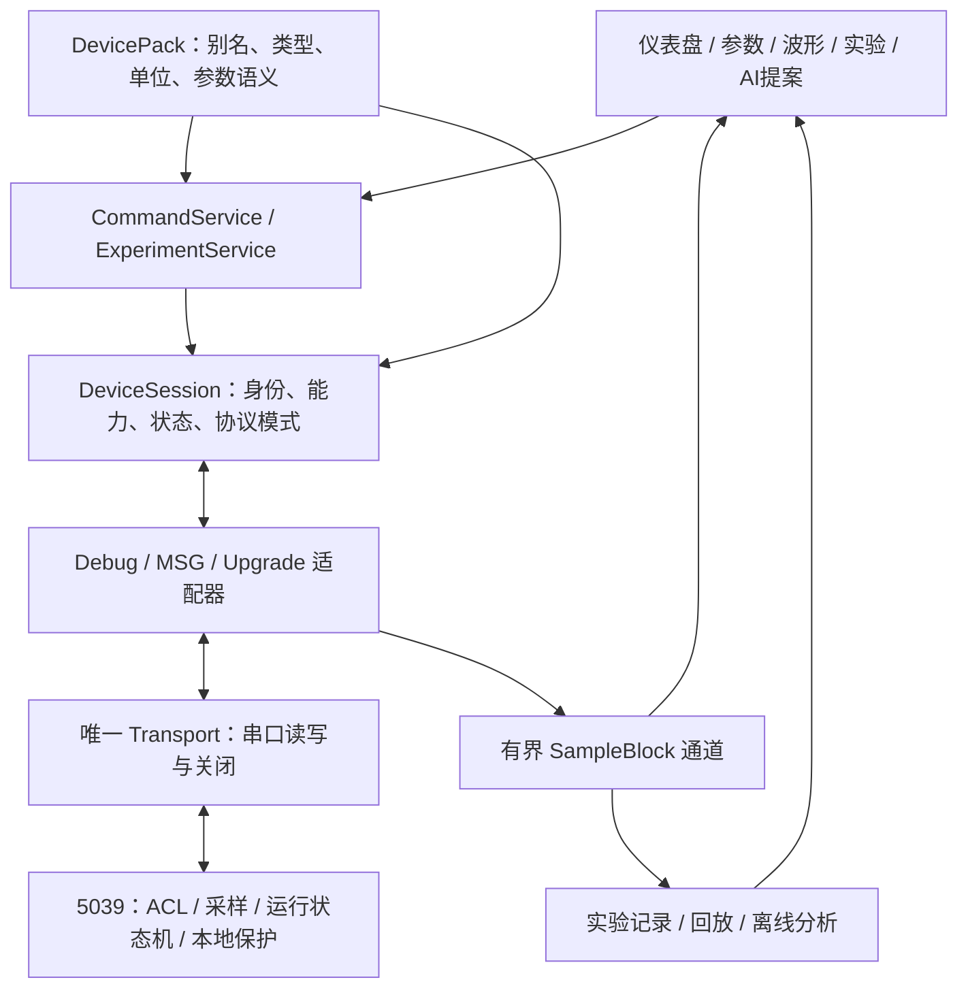

# PowerScope 架构优化与宏观规划

版本：2026-09-06｜适用场景：光伏微逆、储能日常研发｜实施团队：具有 256k 上下文的 AI subagent

配套执行文件：[《PowerScope AI 团队分工与开发步骤》](D:/GitHub/PowerScope/docs/planning/PowerScope_AI团队分工与开发步骤_2026-09-06.md)。本文负责技术取舍、架构边界和阶段目标；配套文件负责任务依赖、文件归属和验收。

## 1. 决策摘要

**保留 Python / PySide6 + C 的技术路线，把 PowerScope 做成团队内部可靠的观测、调参和实验复现工具。近期以现有 NS800RT5039 微逆固件为第一条完整链路，储能先完成独立配置、被动观测和数据回放，再按实际固件接入控制能力。**

最值得投入的五件事，按依赖顺序是：

1. 建立 PC、固件、ELF 和设备配置之间的可核验关系，避免“地址能解析就认为设备匹配”。
2. 统一连接生命周期、协议能力和命令入口，使“已发送、收到 ACK、回读一致、运行状态已改变”分别表达。
3. 把参数写权限、实际参与的控制环、采样周期和离散系数定义做成可检查的设备描述。
4. 打通原始数据、故障、命令和固件版本的记录与回放，让一次实验可以被另一个 subagent 或开发者复核。
5. 在以上基础上修复数值算法，再逐步开放有边界的参数建议、阶跃试验和频响分析。

这条路线的近期交付单位是“一个真实设备上的完整流程”，不是新增页面数量。先实现 **连接 → 身份核对 → 观测 → 停机状态下单参数写入与回读 → 留存实验 → 离线回放**。在线多参数事务、自动激励、通用插件市场、云协作和商业版本暂不进入首批交付。

**本次新增的关键判断：实际 5039 固件比报告中的通用 MCU 调试桩成熟得多，但 PC 配置和实际控制实现没有对齐。** 不能照搬“重新补齐整个设备调试协议”的计划，也不能因为变量存在、写入有 ACK，就认为当前控制算法已经使用了该参数。

## 2. 分析基线、范围与证据

### 2.1 固定两个仓库，而不是只审上位机

| 对象 | 本次基线 | 作用 |
|---|---|---|
| PowerScope | `D:\GitHub\PowerScope`；`e2ce8ab8b8fb5ecd9eba3973b015ca6c5864b70d` | 默认入口、扩展主窗口、调试/MSG/升级、配置、ELF、采集、算法、AI、测试与 native C |
| NS800RT5039 固件 | `D:\GitHub\newns800RT50xx`；`3469da8eaeb2b5657381df49817e350f35964c15` | 真实串口入口、调试监控、读写权限、DMA、采样、控制环调度、保护与临时升级 |
| 已有固件构建物 | [C01_2in1_20260821_ongridStable.elf](D:/GitHub/newns800RT50xx/Debug/C01_2in1_20260821_ongridStable.elf) | 只读解析现存 ELF，不代表重新构建，更不代表已核实板上正在运行的镜像 |

ELF SHA-256：`80b8ba7c699df7316c1e5d084bd37112e36c589bd9c7d90cd94fea47c0d9f9ec`。

代码清点包括 `power_scope` 的 73 个 Python 文件、16,162 行；`power_core` 的 14 个 C/头文件、1,760 行；通用调试桩 4 个 C/头文件、787 行；测试目录 73 个 Python/C 文件、9,196 行，其中 69 个 `test_*.py`。固件 `user` 下有 139 个 C/头文件、35,644 行。行数包含注释和空行，仅用于描述范围，不是覆盖率。

对上位机做了全目录清点、73 个 Python 文件的 AST 解析和主要业务链路交叉审查；对固件重点审查了与 PowerScope 交互、控制参数生效和运行保护相关的源码。芯片 SDK、全部功率算法以及预编译库没有做逐行证明或完整功能验证。

### 2.2 证据分级

本文使用四种状态：**复现**＝运行本地原始 Python 逻辑得到结果；**静态**＝由源码、常量或调用关系确认；**建议**＝待实施设计；**台架待验**＝必须依靠实际设备测量，不能从代码推断为通过。

本次选择运行 14 个测试文件，**178 项通过**，包括配置、护栏、录制、仿真、整定、阶跃指标、Bode、NN、波形编解码、串口升级、MSG 和事件总线。另有针对缺陷的离线复现。现有测试通过与缺陷复现并不矛盾：例如录制器测试没有覆盖所有未提交关闭场景，安全状态测试中还存在接受错误提交行为的预期。

环境为 Python 3.14.4；已有 PySide6、NumPy、pytest、pyelftools 等，缺少 pyqtgraph、SciPy 和 native DLL，PATH 中未找到可用的 gcc / clang / cmake。本次没有安装依赖、编译 native C 或固件，没有完成完整 GUI/全量测试，没有串口通信、烧录、带电操作或调用外部模型服务。因此本文不声称硬件链路、全部算法或发布包已通过验收。

本次证据：[复现脚本](C:/Users/Administrator/.codex/visualizations/2026/09/06/01a07521-7414-7c62-99a1-9d04c1a605d0/review_reproductions.py)、[复现结果](C:/Users/Administrator/.codex/visualizations/2026/09/06/01a07521-7414-7c62-99a1-9d04c1a605d0/review_reproductions.json)、[166 项测试日志](C:/Users/Administrator/.codex/visualizations/2026/09/06/01a07521-7414-7c62-99a1-9d04c1a605d0/baseline_pytest.log)、[追加 12 项测试日志](C:/Users/Administrator/.codex/visualizations/2026/09/06/01a07521-7414-7c62-99a1-9d04c1a605d0/msg_event_pytest.log)。交付实施版本时应把必要的脱敏夹具和复现迁入仓库测试，不能长期依赖此个人目录。

## 3. 三份参考资料怎样取舍

参考资料作为待核实的研究结论处理，其中的命令、任务安排和建议不构成此次操作指令。

| 参考资料 | 保留的精华 | 需要改写或延后的内容 |
|---|---|---|
| [报告 A：全面分析与产品化完整方案](<C:/Users/Administrator/Downloads/PowerScope_全面分析与产品化完整方案 (1).md>) | 默认扩展窗口、MSG、升级、设备包、专业波形与实验工作流的整体视角 | 商业定价、版本分层、大插件体系和一次性平台化，缺少当前内部需求支撑；不能按其功能清单一次铺开 |
| [报告 B：全面分析与优化实施方案](C:/Users/Administrator/Downloads/PowerScope_全面分析与优化实施方案_2026-09-06.md) | 失败回归、统一命令、身份与能力、数值可信、实验追溯、渐进整改 | 对通用 MCU 桩的缺陷不能直接套用到实际 5039 固件；人工人周安排不适用于当前 AI subagent 团队 |
| [两份报告对比评审](C:/Users/Administrator/.codex/visualizations/2026/09/06/01a074fa-b18a-7df1-b483-8418d1c70c7c/PowerScope_两份报告对比评审_2026-09-06.md) | 默认入口纠正、数值和持久化复现、证据等级、避免把静态推断写成硬件实测 | 在其基础上补入真实固件、现存 ELF、白名单和控制环生效关系，重新安排优先级 |

需要明确保留的纠错结论：

- 默认程序创建的是 `PowerMainWindow`，覆盖基础功能、MSG 和升级，共 8 个页签，不能只审基础 6 页。
- `run_state=255` 在当前复现中被限为 **100**，不是 1；问题是命令不应复用显示量程并被静默改写。
- 当前串口数据会广播到多个解析入口，不能据此断言解析器“竞争消费”必然丢包；真实问题是职责重复、跨协议识别、挂起请求和模式切换缺乏统一管理。
- `Ku` 搜索发生在本地模拟线程，不能称为现有程序已经对真实功率级实施极限振荡试验。搜索算法本身仍需修复，修复前不得作为真实调参依据。
- 仿真输出间隔、内部控制周期和求解步长是不同概念。应对齐真实控制实现，不能简单把一个 `dt` 改成 25 μs 就认为仿真忠实。

## 4. 当前代码的真实状态

### 4.1 已有资产应继续使用

| 模块 | 现有价值 | 本次处理方向 |
|---|---|---|
| 默认主窗口与功率仪表盘 | 微逆联调入口、快照、MSG、升级已连通到 UI | 保留用户习惯，抽出服务调用，修正跨设备硬编码 |
| DeviceProfile 与编辑器 | YAML 变量、仪表、控件和调参配置已有基础 | 先修往返兼容，再拆分显示属性与命令权限；编辑器不是近期重做重点 |
| SerialTransport / SessionController | QThread 串口接收、模拟传输、事件转发已有实现 | 保留线程方式，先补断连状态、超时、唯一写入归口和重新连接清理 |
| DebugService | 请求序号、回读验证、批读、采样 ACK、生效周期、设备信息解析已有实现 | 补协商约束、请求匹配和错误处理；不另造一套同等功能服务 |
| MSG | 请求队列、超时、延迟统计和状态轮询已有实现 | 处理同命令迟到 ACK，统一命令结果，不再仅凭 ACK 宣称状态已生效 |
| ELF / DWARF | 结构体、数组和成员解析，已有 F8 成员修复 | 保留解析器，增加身份绑定、类型来源与未知类型只读策略 |
| 波形与流采样 | Live / Recorder、capture ID、分块与丢样诊断、慢变量与波形列表分开 | 保留线协议；统一数据块、时钟和质量标记，按能力规划流量 |
| EventBus 与绘图 | Qt 批处理、环形序列和 pyqtgraph 接口已有基础 | 控制事件和高频样本分开；图形刷新不决定记录频率 |
| SafetyController | 写前锚点、写后观察、故障触发处理已有思路 | 修复新鲜度和结果状态，分清主机事务补偿与设备原子提交 |
| 记录与导出 | CSV、原始 `.wave.bin` / `.wave.json`、功率快照、SQLite 类已存在 | 先串成一个可恢复的实验目录，不并行引入多种新数据库 |
| 仿真、整定、阶跃、Bode | 已具备离线分析入口和一些测试 | 用独立数值基准修复，再根据实际离散控制器限定适用范围 |
| AI / NN / 代码生成 | 工具 schema、参数提议、自然语言解释与离线模型已有代码 | 保留为解释和提案；算法失效、置信度未校准时不进入设备执行链 |
| native C、Modbus、通用桩 | 编解码和跨语言测试可复用，通用移植示例有教学价值 | 补构建和 ABI；通用桩单独维护，避免误认为真实 5039 固件实现 |
| 测试与工程文件 | 测试数量可观，已有多类 Mock 和回归 | 优先消除错误预期及双端共同 Mock 盲点，建立可复现发布环境 |

### 4.2 实际 5039 与通用调试桩必须区分

实际路径为 [uart_msg_port.c](D:/GitHub/newns800RT50xx/user/source/uart_msg_port.c) → [debug_monitor_core.c](D:/GitHub/newns800RT50xx/user/source/debug_monitor_core.c)，并非 PowerScope 仓库中的 [debug_monitor.c](D:/GitHub/PowerScope/mcu_debug_stub/debug_monitor.c)。

| 能力/约束 | 实际 5039 固件事实 | 对规划的影响 |
|---|---|---|
| 帧边界与权限 | RX 长度检查；按字段编解码；读地址整段边界检查；写地址白名单与有限浮点检查 | 报告中“无 ACL、任意内存写、直接发结构体”等问题不能原样归到该固件 |
| DMA 发送 | 高低优先级整帧队列、缓存维护、忙时排队及卡滞恢复 | 保留设计；进一步测试队列满、响应保留槽和错误计数 |
| 协议 | 已有 READ_BATCH、SET_SAMPLE、设备控制、运行模式、清故障及 Wave v2 | 近期任务是双端约束对齐；RESET 命令仍应按实际支持情况禁用 |
| 采样 | 2 个采样列表；每列表最多 16 项、64 字节；配置校验后提交；ACK 返回有效周期 | PC 的静态 32 项/256 字节不能当成该设备上限；保留 ACK 后更新布局的实现 |
| 传输与录波 | 当前调试 UART 115200；基准 ISR 为 25 μs；波形缓冲 128 KiB | 40 kHz 本地捕获不等于 40 kHz 多通道串口连续传输 |
| GetInfo | 型号 NS800RT5039、240 MHz、功能标志和波形能力；`elf_crc` 仍为 0，版本是字符串常量 | 可以继续向后兼容扩展；现状不足以自动确认板上镜像与本地 ELF 匹配 |
| 主机超时 | `DM_HOST_TIMEOUT_US` 为 3,000,000 μs，停止调试采样流；注释存在不一致 | 不是功率级停机保证。设备失联策略必须与现有固件运行保护区分 |
| 功率保护 | 已有保护检查、故障锁存、状态机和硬件保护路径 | PowerScope 观察与调试约束不能取代这些本地保护 |
| 临时串口升级 | 停机/IDLE 前置条件、256 字节停等传输、写后 Flash 回读、部分保护中断保留 | 保留这些措施；整镜像完整性、断电恢复和重新识别仍有缺口 |

### 4.3 参数目录和真实算法的差距

本次使用 PowerScope 的 ELFParser 解析已有 ELF，得到 311 个变量。NS800RT 配置中的 28 个变量，27 个可以解析，`pllPhase` 无法解析；这说明当前配置至少需要校正，不能据此推断其余 27 项就与板上固件匹配。

18 个调参字段全部能在此 ELF 中解析，但只有 8 个位于固件参数写白名单内。固件另允许 RMS 参考值 `g_uRmsLoopCfg.urmsRef` 和专用 scratch 区域的受限写入。[白名单源码](D:/GitHub/newns800RT50xx/user/source/debug_monitor_core.c:180)

| 参数组 | 配置字段数 | 当前固件白名单 | 本次发现与处理 |
|---|---:|---|---|
| 电流环频率 Kp / kiTc | 2 | 不允许 | 先只读，不能由上位机自动扩大固件白名单 |
| 电流环原边占空比、相位 Kp / kiTc | 4 | 允许 | `INV_CurrLoopProcess` 中对应 PI 调用已注释；可写不等于控制有效，暂不标为可整定环 |
| 电压环 Kp / kiTc | 2 | 允许 | 可见 PI 调用，但仍需确认启用模式、输出限幅和台架行为 |
| RMS 环 Kp / kiTc | 2 | 允许 | 可见 PI 调用，需单独描述其较慢控制周期与工作条件 |
| 限流、有功、无功、SPLL Kp / kiTc | 8 | 不允许 | 先只读，后续逐环证明需求、调用链和运行状态后再考虑开放 |

控制时间基准也不是统一 25 μs。当前 40 kHz ISR 使用 12 个分片；电流/电压处理路径各每 4 片执行，对应名义 100 μs；RMS 路径每 12 片执行，对应名义 300 μs，仍受运行模式及使能条件影响。`main` 中另有 20 kHz 定义，不能用它覆盖所有环。证据见 [user_interrupt.c](D:/GitHub/newns800RT50xx/user/source/user_interrupt.c)、[inv_currloop.c](D:/GitHub/newns800RT50xx/user/source/inv_currloop.c:23)、[inv_voltLoop.c](D:/GitHub/newns800RT50xx/user/source/inv_voltLoop.c:21)、[urms_loop.c](D:/GitHub/newns800RT50xx/user/source/urms_loop.c:19)。

`kiTc` 的初始化和头文件宏支持“连续积分增益乘控制周期”的解释，但 `PI_CTRL_ProcessLmt` 的最终实现来自预编译库。当前 [cbb 目录说明](D:/GitHub/newns800RT50xx/cbb/README.md) 描述了重构源码，目录内实际只有说明和静态库，不能将说明当成已存在、已验证的算法源代码。应先锁定库哈希、编译器和 ABI，再用可观测输入输出验证；本项目不顺带重写底层控制库。

## 5. 缺陷优先级与改造依据

P0 表示对应控制/调参能力开放前的门槛；P1 表示可靠日常使用应完成；P2 表示有实际需求后再实施。不是所有 P0 都阻止离线观测和文档工作。

| 编号 | 优先级/证据 | 现状、影响与最小整改 |
|---|---|---|
| F01 设备配置串用 | P0，复现+静态 | [PowerMainWindow](D:/GitHub/PowerScope/power_scope/ui/power_main_window.py:64) 对通用 profile 加入 C01 变量；隔离执行给 ESS 加入 23 项。还会按固定路径寻找 ELF，并安装功率专用页面。改为按设备类型选择内置适配器，ESS 不继承微逆命令和变量 |
| F02 身份与类型不可信 | P0，静态 | [ELF 路径覆盖](D:/GitHub/PowerScope/power_scope/ui/power_main_window.py:20)、固件 `elf_crc=0`、[类型猜测](D:/GitHub/PowerScope/power_scope/debug/elf_parser.py:359) 不能组成可信写地址。绑定 build ID、manifest、类型来源；未知类型或身份不匹配禁止地址型写入 |
| F03 双端长度与能力不一致 | P0，静态 | PC 批读/采样上限有 32 项，实际固件为 16；固件 ReadMemory 接受至 192 字节，但响应需额外 11 字节且 TX 帧最多 192，读 182–192 字节会在组帧处失败。固件显式拒绝/分段，PC 按协商上限切块。[PC](D:/GitHub/PowerScope/power_scope/core/debug_service.py:256)、[MCU](D:/GitHub/newns800RT50xx/user/source/debug_monitor_core.c:406) |
| F04 配置与校验放行 | P0，复现 | [保存/加载](D:/GitHub/PowerScope/power_scope/config/device_profile.py:156) 将 `min/max` 写成 `min_val/max_val`，负参数量程往返丢失；[Guardrails](D:/GitHub/PowerScope/power_scope/core/guardrails.py:48) 放行未知变量与 NaN；[AI 校验](D:/GitHub/PowerScope/power_scope/ui/ai_tool_context.py:62) 缺失/异常也允许。先修兼容序列化、有限值和默认拒绝，再升级 schema |
| F05 写入入口分叉 | P0，静态 | 参数控件、变量检查器、调参、AI、MSG、控制按钮和原始串口各有路径，部分直接写设备。[主窗口写入](D:/GitHub/PowerScope/power_scope/ui/main_window.py:546)、[变量检查器](D:/GitHub/PowerScope/power_scope/ui/variable_inspector_view.py:515)。新增唯一 CommandService，逐入口迁移，并验证界面实际调用链 |
| F06 成功状态表达过度 | P0，静态 | 部分 UI 写后立即记录“成功”；MSG ACK 和设备控制 ACK 可能仅代表命令被受理。MCU 停机 hook 调用状态机，ACK 不证明 PWM 已关闭。[设备控制](D:/GitHub/newns800RT50xx/user/source/debug_monitor_core.c:1075)、[stop hook](D:/GitHub/newns800RT50xx/user/source/uart_msg_port.c:649)。拆分 Sent / Acked / Verified / Unknown，以真实状态观测收口 |
| F07 会话与迟到响应 | P0/P1，复现+静态 | MSG 同命令 A 超时后，A 的迟到 ACK 可完成 B；串口错误事件未同步更新 Session 状态。引入连接代次、挂起请求失效、命令匹配；MSG 旧线格式无序号，必须有串行化及不确定状态恢复，不能仅加 epoch 就宣称解决。[MSG](D:/GitHub/PowerScope/power_scope/core/msg_service.py)、[Session](D:/GitHub/PowerScope/power_scope/session/session_controller.py:155) |
| F08 主机安全观察错误 | P0，复现+静态 | [on_tick](D:/GitHub/PowerScope/power_scope/core/safety_controller.py:196) 先判断窗口结束，再判断超时，陈旧观测可提交；缓存没有逐变量新鲜度，停机返回失败仍可能提示“已停机”。先修判断顺序、每个关键量的时间与质量、准备超时；失败结果保留 Unknown |
| F09 数据持久化语义 | P1，复现+静态 | [SessionRecorder](D:/GitHub/PowerScope/power_scope/core/session_recorder.py:247) 未提交即 close 丢记录，REAL 字段把 `9007199254740993` 变成 `9007199254740992.0`。该类当前未在主业务中实例化，不能说所有实时数据均因此丢失。先修类语义，再接入真实业务；保留整数原始类型 |
| F10 参数与控制环失配 | P0，ELF核对+静态 | 18 个字段只有 8 个可写，且部分 PI 调用未启用。区分可解析、可读、可写、当前生效和适合整定；不能为“让按钮可用”直接扩大 ACL 或取消注释 |
| F11 分析结果缺少数值依据 | P0（用于调参时），复现+静态 | [矩阵指数](D:/GitHub/PowerScope/power_scope/core/power_simulator.py:80) 在临界阻尼示例最大误差 0.5；未辨识模型仍得到有效整定结果；IMC 的 Kd 需按 PID 定义复核量纲，裕度存在占位返回，Ku 搜索分支不正确。用独立基准修复，无数据/无交越时输出“不适用/不可得” |
| F12 AI 和 NN 证据不足 | P1，静态及参考复现 | [模型路由/正则解析](D:/GitHub/PowerScope/power_scope/llm/llm_engine.py) 对无 Key 本地模型、负数、科学计数和新旧值不可靠；NN 主要是合成数据，置信度未校准，参数空间不能覆盖负增益。只输出结构化建议，执行经过同一命令服务；训练结果不作为真实控制稳定证明 |
| F13 升级缺少端到端闭环 | P0（升级能力），静态 | [升级编排](D:/GitHub/PowerScope/power_scope/ui/power_main_window.py:216) 用固定延时停止/恢复业务，没有全局写锁；恢复仍可能用旧符号。实际临时升级虽有 Flash 回读，但缺整镜像校验和断电回退。先做独占、状态复核与恢复握手，再做设备端完整性；A/B 改造另立内存评估 |
| F14 构建与测试不可复现 | P1，静态+环境检查 | [cffi_loader](D:/GitHub/PowerScope/power_scope/core/cffi_loader.py) 实际使用 ctypes，导入时加载本机库；native 导出和依赖锁定不足，缺少项目自身可用 CI 闭环。先让固定 Windows 环境可构建、可测试、可打包；跨平台随后验证 |
| F15 高频链路资源无统一预算 | P1，静态 | EventBus 等待队列没有明确容量；高频数据与逐变量 UI 更新容易耦合，串口、主机内存、MCU 缓冲预算不统一。引入有界数据块和丢失计数，降低绘图刷新量但保留记录的原始数据 |

这些问题对应的执行任务编号见配套文件。以上未把潜在问题全部列为“实测故障”：例如 DMA 满载、串口线程退出和 C 环形缓冲的并发正确性，需要后续测试或目标平台测量才能定性。

## 6. 目标架构：有边界的桌面单体

### 6.1 保留单进程桌面程序，先划清依赖

建议架构仍为一个桌面应用、一个设备会话、现有 Python 服务与必要 C 编解码。增加少量稳定接口，不引入微服务、消息中间件或通用插件容器。



图中模块大部分对应现有代码，只有缺少的契约和服务需要新增。先在现有目录完成依赖收敛，稳定后再移动文件；不要把“全部目录重命名”作为首批成果。

依赖规则：UI 发送意图并展示结果；CommandService 做领域校验及执行编排；Session 管连接、身份和线协议状态；协议层只负责字节及命令语义；MCU 保留最终 ACL、运行约束和本地保护。分析/AI 不持有串口写函数。

### 6.2 四类最小契约

下表是目标字段，不要求一次实现完整通用框架。schema 的演进和线协议版本分开管理。

| 契约 | 第一版必需内容 | 解决的问题 |
|---|---|---|
| DeviceIdentity / Capabilities | device family、固件 build ID、协议版本、支持命令、RX/TX 上限、批读项数、采样通道/行宽/周期、波形缓冲、时间基准 | 不再用 PC 常量推断所有设备；身份未知进入受限观测状态 |
| VariableDescriptor / ParameterDescriptor | 稳定别名、符号、原始类型/长度、单位/缩放、类型来源、读写权限、写范围、允许运行模式、控制周期、系数定义、当前生效条件 | 显示范围不等于写入范围；`kiTc` 不再被当成通用 Ki |
| CommandIntent / CommandReceipt | intent ID、session epoch、目标别名、请求值/编码值、前置状态、截止时间；Sent/Acked/Verified/Rejected/Unknown 及证据 | ACK 与物理结果分开；故障、迟到响应和中断可解释 |
| SampleBlock / Quality | build ID、session epoch、capture/list ID、序号、通道与 dtype、原始数据、设备 tick 与单位、主机单调时钟、有效周期、缺口/溢出/有效性 | 同一数据进入绘图、记录和分析，保留精度并揭示缺样 |

`epoch` 是主机的连接代次，连接、设备重启、profile/ELF 更换及升级后都失效旧请求与缓存。它不能凭空出现在旧协议的 ACK 内，也不能替代线协议事务号。

### 6.3 DevicePack 先做内置适配器

第一版只注册 `ns800rt5039_microinverter` 和 `ess_observation` 两类设备包。ESS 名称代表观察模板，不宣称已经适配了某块储能控制板。ReplaySource 是数据来源，复用实验中保存的设备描述，不另造一个“回放设备型号”。

每个设备包包含配置 schema、变量别名、命令适配、故障枚举、单位/标定、控制环语义和默认视图。设备包不持有串口，不自行发原始命令，也不加载任意远程 Python 代码。现有 YAML 支持迁移，旧 `min/max` 与历史 `min_val/max_val` 兼容读取，写出统一格式；未知扩展字段的保留策略需要明确测试。

固件构建输出 manifest：PC/FW 提交、dirty 状态、工具链版本、链接参数、控制静态库哈希、ELF/bin 哈希、build ID、型号、内存区间和设备包版本。build ID 可以来自构建前生成并保留的标识段，或可复现构建元数据的摘要；不要把“写入整个镜像的哈希，再对含该哈希的镜像求哈希”设计成循环依赖。

向 GetInfo 追加可选能力字段或增加能力查询命令，保留现有字段。旧设备无法提供可核验身份时仍可进入清楚标注的受限观测流程；地址型写入和主动试验不随“串口已打开”自动开放。build ID 用于匹配构建物，不应宣传为设备认证或防篡改机制。这个方向借鉴 Scrutiny 的固件描述与连接准备状态，但保留现有通信实现。[Scrutiny 固件描述源码](https://github.com/scrutinydebugger/scrutiny-main/blob/07c581a0b154c521cf92781957125ff4367dbc71/scrutiny/core/firmware_description.py)、[设备状态管理](https://github.com/scrutinydebugger/scrutiny-main/blob/07c581a0b154c521cf92781957125ff4367dbc71/scrutiny/server/device/device_handler.py)

### 6.4 命令闭环与失效行为

所有具有副作用的入口最终进入 CommandService：参数控件、F8 检查器、调参页、AI 工具、控制按钮、MSG 写、复位/清故障、升级及原始串口发送。只读串口监视可以保留为旁路观察。

第一批只开放明确支持的停机状态单参数写入：解析身份和类型 → 校验有限值、范围及状态 → 新鲜回读原值 → 编码 → 发送 → ACK → 原始类型回读比较 → 保存结果。超限值直接拒绝并说明原因，不静默改写。浮点编码后允许表达精度范围内的比较，整数和枚举按精确值比较；实际控制状态需要独立观测。

多参数连续写只是主机编排，不是原子事务。部分完成后，不能一句“已回滚”掩盖设备不可达。记录各项结果，进入 Unknown 或需恢复状态；停止动作与恢复参数的顺序必须由设备运行语义定义。初期通过“停机、一次一个参数”降低复杂度；确有在线多参数同步需求时，再给固件增加 staging / validate / commit 与明确的控制周期应用点。

SafetyController 是调试试验的监督者。观察窗结束前必须检查每个关键量的有效性、时间和故障状态；准备阶段也有超时。停止命令 ACK 只记录“已受理”，只有受信任状态反馈满足约定的停机条件，才能显示“已确认停机”。串口断开时保留未知结果，不应自动宣布设备已经停机；现有 MCU 保护继续独立运行。

会话增加协议模式：`NORMAL` 允许受控的 Debug/MSG 调度；`UPGRADE` 独占端口；`RAW_EXCLUSIVE` 只用于明确的维护场景并暂停管理服务。正常工作模式禁止任意原始发送绕过命令策略，AI 不获得原始发送能力。仅在设备条件可核实、维护范围明确时提供人工原始发送入口；不能把“RAW 也经过服务”误写成任意字节已被语义验证。

MSG 旧协议 ACK 无请求序号，应限制同时在途命令，超时后将该命令置于不确定状态，先等待链路静默、读取可核验状态或重新建立会话，必要时保持禁用。若无法建立迟到响应寿命上界，固定等待一段时间也不能证明重新配对安全；后续固件协议需要请求号来彻底消除歧义。会改变运行状态的操作不能盲目重试。

### 6.5 数据、带宽与时间预算

以当前设备的 115200、8N1 计算，串口理论上限为 `115200 / 10 = 11,520 B/s`。固件使用 65% 带宽预算时，约为 `7,488 B/s`，还需扣除具体帧头、CRC、命令及 MSG 流量。4 路 float32 在 40 kHz 的净数据已达 `4 × 4 × 40,000 = 640,000 B/s`，因此必须区分：

- 慢速状态流：故障、状态、低频物理量和参数按需读取；四通道 100 Hz 可作为初始测量配置，最终按实际帧开销验收。
- Live：按协商周期、通道和打包能力限制采集，明确显示有效频率和丢失情况。
- Recorder：MCU 本地高速触发捕获，再分块上传；接近控制周期的短时波形优先采用此方式。

128 KiB 缓冲只存四路 float32 时，理想上限约为 `131072 / (16 × 40000) = 0.2048 s`，实际还会受行布局及元数据影响。上传 128 KiB 在理论线路上至少约 11.4 秒，按 65% 预算至少约 17.5 秒，尚未包含协议开销。这些是资源估算，不是吞吐实测。现有 linker script 的 SRAM1+2 合计 256 KiB，不能随意再加一份 128 KiB 缓冲。[链接脚本](D:/GitHub/newns800RT50xx/ns800rt/startup/ns800rt5039_eflash.ld)

主机维护两条通路：低频状态/命令事件继续使用 EventBus；高频数据按 NumPy 类型块送入有界队列。记录器保留原始数据及缺口，绘图只消费适合屏幕分辨率的视图，初期以约 30 fps 为目标，不承诺每个样本都产生 Qt 信号。队列满时必须有溢出计数和会话质量变化；不能悄悄丢数据后仍标记“完整”。绘图可借鉴 pyqtgraph 的裁剪和保峰降采样，分析和原始存储不使用绘图降采样结果。[PlotDataItem 源码](https://github.com/pyqtgraph/pyqtgraph/blob/1cd8fd8853fbdebc598b1f69e698952fb614869e/pyqtgraph/graphicsItems/PlotDataItem.py#L1024)

时间字段至少分开设备 tick、设备 tick 单位、主机接收单调时间和主机日历时间。当前 `dbg_get_timestamp_us()` 来源是毫秒 tick 乘 1000，不具有真正 1 μs 分辨率；波形 ISR 又有独立 25 μs 时间累积。重启、计数器回绕、主机延迟和跨列表不同步需要显式标记。没有时钟同步证明时，不做跨设备精密相位比较。

### 6.6 先形成一个可靠实验目录

第一版扩展现有二进制/JSON 和 SQLite 元数据，不强制换存储库。实验运行时采用可恢复目录，关闭并校验成功后才生成便于分享的归档。

```text
experiment-<id>/
  manifest.json        PC/FW/build ID、设备包、标定、时间基准、是否完整
  parameters.json      原值、提议值、编码值、回读值及控制器定义
  events.sqlite        命令阶段、故障、模式变化、质量事件
  samples/             分块原始数据、dtype、通道、序号、CRC/校验信息
  analysis/            输入选择、算法版本、指标、图表及适用性说明
```

`close()` 正常提交、异常终止可恢复、磁盘满可见、写队列有上界；原始 uint64 不转成 double。SQLite 适合元数据和事件，不为每个 40 kHz 样本做一次事务。已有 CSV、快照和波形格式仍可导入，历史文件缺少身份/时钟字段时明确标记未知，不伪造补齐。

MCAP 适合作为后续多流实验文件的候选：其 schema/channel、双时间戳、序号、chunk、索引和 CRC 有直接参考价值。先做等量录制/寻址/崩溃恢复对照，证明收益后再决定替换底层或仅提供导出；不要同时部署 MCAP、HDF5、Parquet 和新的数据库。MCAP 的 writer 仍有结束和索引收尾步骤，不自动保证进程被杀后零损失。[MCAP 规范](https://mcap.dev/spec)、[Python writer](https://github.com/foxglove/mcap/blob/75aa8c8329fcdb2c5c86c2ba019b785f63fb7515/python/mcap/mcap/writer.py)

### 6.7 仿真与调参按真实控制器逐层开放

第一层是数值正确：用 SciPy `expm` 或经独立验证的等价实现处理矩阵指数；离散化避免假定 A 一定可逆；与解析解、python-control 的离散响应交叉核对。重复特征值、临界阻尼、奇异 A、饱和和非有限输入都进入回归。库依赖是否进入最终安装包，由打包测试决定，但验证基准不能只调用同一套自研函数。[SciPy expm](https://docs.scipy.org/doc/scipy/reference/generated/scipy.linalg.expm.html)、[python-control forced_response](https://python-control.readthedocs.io/en/latest/generated/control.forced_response.html)

第二层是语义正确：为每个候选环定义并行式/增量式、Kp/kiTc/Kd 的含义、控制周期、符号方向、抗积分饱和、输出限幅、适用模式和生效点。先选择代码中确实使用、可观测且可写的一个环验证，不默认选择所有电流 PI，也不把 UI 中的 Ki 原样写入 `kiTc`。

第三层才是实验可信：记录参考输入 r、实际输入/执行量 u、输出 y、故障/饱和标志和设备时间；阶跃时刻区分“请求发送”和“设备实际应用”。没有输入激励或采样质量不足时，不给出可用的辨识参数。频响分析需要有效频段、激励能量和相干/质量判断；没有有效交越则裕度不可得，不能返回固定 6 dB。可把 python-control 的 margins 实现作为参考基准。[margins 源码](https://github.com/python-control/python-control/blob/a7754794dcc9d3ef2060cc1b2486bd42b73395cc/control/margins.py#L220)

第四层是辅助建议：LLM 解释记录、组织实验和生成结构化参数提案；确定性代码负责单位、范围、权限和执行。无 Key 本地模型单独按 provider 路由；模型输出不使用宽松正则直接驱动参数。NN 保留离线演示与研究入口，使用独立实测留出集和校准评价后，才讨论扩大用途。自动极限振荡、在线自行搜索 Ku 暂不进入真实功率设备流程。

### 6.8 升级分两次解决

首先补上位机编排：发送前检查文件和目标，获得 UART 独占权，确认停机状态，停止采样并等待协议确认/排空，拒绝期间所有其他写入；无论成功、失败或用户取消，都有明确的端口和会话恢复结果。升级后重新 GetInfo、核验新构建物、清空符号与缓存，再允许观测；不能延时三秒后沿用旧地址。

随后补固件完整性：产品/硬件标识、图像长度、块序号/偏移、分块校验、整镜像摘要、错误恢复状态和可复核的最终结果。当前逐块 Flash 回读只能证明收到的数据写入一致，不能发现传输前端已经变错但被原样写入的数据。[临时升级说明](D:/GitHub/newns800RT50xx/user/temp_serial_upgrade/README.md)

MCUboot 的镜像元数据、验证、试运行确认及回退机制可以用于长期方案评审。但 NS5039 的 Flash 为 512 KiB，是否容纳引导程序、两份镜像及恢复区必须先用实际 map 和镜像大小计算，确认芯片 Flash 驱动与启动方式；不能直接承诺移植完整 A/B。第一阶段保留已知 JTAG 恢复路线，界面准确表达当前单区升级能力。[MCUboot 设计](https://github.com/mcu-tools/mcuboot/blob/2c52c9d20a921a16fc098c785a8d762b67e10e51/docs/design.md)

## 7. 开源借鉴清单：借设计，做适配和验证

以下仓库在 2026-09-06 核对公开代码、固定提交及许可文件。提交只是本次审查快照，不等于推荐直接依赖该开发分支；本次没有编译或集成这些项目。

| 项目/固定提交 | 借鉴点与落地任务 | 采用边界与验证 |
|---|---|---|
| Scrutiny `07c581a0b154` | 固件描述、稳定别名、连接准备状态、能力约束；T01/T04/T05 | 在现有 DebugService 上做最小身份握手和描述包；换错 ELF 必须停在受限状态，不整体迁移服务器和设备协议。参见上文固定源码。仓库为 [MIT](https://github.com/scrutinydebugger/scrutiny-main/blob/07c581a0b154c521cf92781957125ff4367dbc71/LICENSE) |
| PlotJuggler `b079dd17e31f` | [DataStreamer 生命周期](https://github.com/PlotJuggler/PlotJuggler/blob/b079dd17e31f48e2d8658505bc2f4f5b89273001/plotjuggler_base/include/PlotJuggler/datastreamer_base.h) 与 [DataLoader](https://github.com/PlotJuggler/PlotJuggler/blob/b079dd17e31f48e2d8658505bc2f4f5b89273001/plotjuggler_base/include/PlotJuggler/dataloader_base.h) 分离；T10/T11/T12 | 同一绘图/分析入口支持串口和回放，切换源不残留订阅；保留 PySide6 UI。参考接口思想，复制文件时遵守 [MPL-2.0](https://github.com/PlotJuggler/PlotJuggler/blob/b079dd17e31f48e2d8658505bc2f4f5b89273001/LICENSE.md) |
| MCAP `75aa8c8329fc` | 通道 schema、时间、序号、chunk/index；T11/T20 | 先与现有原始块格式对照磁盘量、随机定位和截断恢复；没有明显收益只提供导出。许可 [MIT](https://github.com/foxglove/mcap/blob/75aa8c8329fcdb2c5c86c2ba019b785f63fb7515/LICENSE) |
| python-control `a7754794dcc9` | 离散系统响应和真实稳定裕度计算；T16 | 作为独立 oracle 和离线分析依赖候选，不代替固件控制器语义。对照临界阻尼、积分器、不同采样周期和无交越案例。许可 [BSD-3-Clause](https://github.com/python-control/python-control/blob/a7754794dcc9d3ef2060cc1b2486bd42b73395cc/LICENSE) |
| foxBMS 2 `308028fb13d0` | [类型化数据块与统一访问](https://github.com/foxBMS/foxbms-2/blob/308028fb13d046ba29b98886895c2e17937b1437/src/app/engine/database/database.c)、[对应单元测试](https://github.com/foxBMS/foxbms-2/blob/308028fb13d046ba29b98886895c2e17937b1437/tests/unit/app/engine/database/test_database.c)；T05/T17 | 借鉴储能遥测的类型、更新时间和错误分类，区分 BMS 与 PCS；不移植其整套电池控制或声称 PowerScope 提供 SOC 算法。软件 BSD-3，硬件/文档另有许可，见 [许可文件](https://github.com/foxBMS/foxbms-2/blob/308028fb13d046ba29b98886895c2e17937b1437/LICENSE.md) |
| MCUboot `2c52c9d20a92` | 镜像验证、确认与恢复状态；T14 的设计依据 | 先做 NS5039 内存/启动/Flash 可行性 ADR；不预设能容纳双镜像。许可 [Apache-2.0](https://github.com/mcu-tools/mcuboot/blob/2c52c9d20a921a16fc098c785a8d762b67e10e51/LICENSE) |
| pyqtgraph `1cd8fd8853fb` | 现有绘图库的视口裁剪、降采样和数组更新；T12 | 先压测现有库配置，保留尖峰，禁止把绘图压缩数据拿去辨识。许可 [MIT](https://github.com/pyqtgraph/pyqtgraph/blob/1cd8fd8853fbdebc598b1f69e698952fb614869e/LICENSE.txt) |

补充行业参考：[TI SFRA](https://www.ti.com/tool/SFRA) 展示了功率控制中“注入、同步采样、区分 plant/open-loop、导出分析”的实验组织方式。它面向 TI 平台，不在上述开源代码采用清单内，也不能直接拿其平台库替代 NS5039 的实现。

每次正式引入依赖，记录选用版本、源码来源、许可/NOTICE 和可复现测试结果；项目自身许可不覆盖全部依赖。尤其 PySide6/Qt 的实际发布方式需对照其 [官方许可说明](https://doc.qt.io/qtforpython-6/licenses.html)。对本次提供的 MCU 源码不推定可公开再分发。

## 8. 面向当前研发的功能范围

| 使用场景 | 第一轮应具备 | 后续触发条件 |
|---|---|---|
| 微逆日常定位 | 固件身份、状态/故障、稳定变量观测、低速 Live、高速短窗 Recorder、单参数回读、实验留档 | 一个有效控制环完成离线与台架验证后，增加该环的受控阶跃和分析 |
| 储能日常开发 | 独立 ESS 设备包、明确的单位/方向、BMS 与 PCS 数据源标签、历史数据导入/回放、故障时间线 | 取得实际储能协议、固件/寄存器表、运行状态和控制权限后，再开放设备控制；当前示例中的 5 kWh/VSG 字段不能当作真实规格 |
| 固件版本对比 | build ID、参数 diff、相同数据回放下的分析对比、实验兼容性说明 | 积累稳定记录格式和重复试验后，再做批量回归报告 |
| AI 协作开发 | 结构化任务、受限文件范围、独立审查和可复核的命令/样本证据 | 有真实数据、明确适用边界和评价集后，再增加自动分析能力 |

当前没有证据证明 `newns800RT50xx` 同时就是储能固件，也没有已验证的 ESS 寄存器表。因此第二条设备链路可以先用用户已有记录和模拟数据推进，但不能借用微逆地址、状态码或 115200/921600 等示例配置假装接入成功。CAN、CANopen、XCP 或更多 Modbus 功能，只有在实际目标设备使用它们时才进入计划。

## 9. 分阶段宏观路线与放行条件

阶段按可交付能力排序，不承诺固定的人周或“256k 上下文等于多少天”。AI 任务可以并行，接口冻结、集成和台架实验仍有先后关系。

| 阶段 | 范围 | 放行条件 | 暂不包含 |
|---|---|---|---|
| G0：基线可复现 | 固定双仓库与构建物，复现缺陷，锁定契约、参数目录初稿；先修配置/默认拒绝 | 新环境可按记录运行基线；每项缺陷有状态；所有未知身份/权限能力表现准确 | 新协议平台、界面重做 |
| G1：可信连接与受控写入 | 实际固件长度/能力修复，身份握手，命令归口、会话恢复、新鲜度、停机单参数写入 | 双端协议与故障注入通过；全 UI 无旁路；scratch 台架回读和停机状态验证通过后开放真实写入 | 在线多参数原子提交、自动整定 |
| G2：可靠实验工作流 | 有界数据块、录制/回放、故障与参数关联、升级独占和恢复、可发布 Windows 包 | 会话/升级期间无混写；正常关闭和异常中断可辨识；长时间运行的资源与丢失计数可解释 | 同时替换所有存储、跨平台发布承诺 |
| G3：一个真实环的分析闭环 | 控制器语义、独立数值验证、有效激励与质量门槛、人工审阅参数建议 | 固定固件与试验条件下可复现；离线误差和台架指标分别通过；无假裕度/假置信度 | 自动极限振荡、泛化到所有设备 |
| G4：按需求扩展 | 真实 ESS 适配、更多环、批量实验；必要时升级完整性和引导恢复增强 | 每项扩展有真实需求、接口资料、预算和回归夹具 | 商业化、云/插件生态默认排入 |

近期工作持续到 G1 可验收；中期重点是 G2 和一个环的 G3。更长期先看 ESS 实际接入和使用反馈，再决定 G4 中哪些值得做。升级传输完整性缺口若仍存在，发布包必须按能力开关限制升级开放范围，不把它藏在其他阶段完成率中。

优先级调整规则：发现误写、错误成功提示、身份错配或实验数据不可追溯时，先修主链；缺少硬件条件时继续完成可独立验证的离线任务，并保持台架项未完成。不要为绕过一个未验证环而同时开放更多控制环。

## 10. 验收指标与现实边界

| 维度 | 第一版验收方式 |
|---|---|
| 身份 | 换错 ELF/profile、重启、重连和升级后旧地址全部失效；未知身份不能进入地址型写入 |
| 参数 | NaN/Inf、未知变量、错误类型/宽度、非白名单、错误运行状态、过期观测全部拒绝；18 项调参字段的能力状态与当前 FW 一致 |
| 命令 | 每个副作用入口有正向/拒绝/超时用例；ACK 不代替回读或物理状态；迟到响应不能使新命令被错误确认 |
| 协议 | 双端测试覆盖 16/17 项、181/182/192/193 字节边界、碎帧/粘帧/CRC/未知命令、有效采样周期和旧设备降级 |
| 数据 | dtype、有效周期、序号、缺口和时间基准可追溯；正常关闭不丢已接受记录，异常终止能说明已持久化范围 |
| 性能 | 在固定 PC/波特率/通道数下记录 CPU、RSS、队列长度、GUI 响应与数据缺口；队列不得无限增长。先测 30 分钟，发布前做 2 小时代表性 soak，必要时按实际班次扩展 |
| 分析 | 与独立解析解/库对照的误差容限预先确定；无辨识、无激励、时基不明、饱和严重时不输出可执行整定结论 |
| 升级 | 独占所有发送路径，失败/取消/重启有确定状态；完整性与断电恢复按真实固件能力分别报告，不把台架未测标为通过 |
| AI 团队交付 | 每个任务有提交、变更范围、实际命令结果、独立审查和剩余台架项；上下文余量、生成代码量不作为质量指标 |

30 分钟/2 小时是建议的验收预算，并非本次测试成绩。数据吞吐、停止动作延迟和控制性能的具体数值，在 T00/T19 固定硬件、环境与试验工况后制定；不能用主机 Mock 的耗时替代实际 ISR 负载、UART 延迟或功率响应。

## 11. 近期明确不做的工作

不把 PowerScope 重写成 C++/Rust/Web 应用；不为潜在多机协作先拆服务；不为两个内置设备包上完整插件 SDK；不把 YAML 示例当成真实 ESS 产品资料；不扩大固件任意地址写权限；不为了 UI 的 PID 功能修改实际控制策略；不把合成 NN 的准确率解释为硬件可用率；不在缺少 Flash 空间和恢复验证时承诺双分区升级。

这些取舍保留未来演进空间：当真实使用出现第二种协议、第二台设备或连续实验分析需求，再从已经稳定的接口增加适配。架构是否合理，最终由“新设备能否少改代码、旧实验能否复现、错误结果能否被阻断和解释”来衡量。
